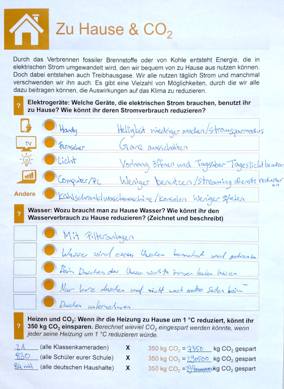

## Die Nachhaltigkeitsambassadore

### von Henkel

Wie jedes Jahr erhielten wir auch im Mai **2023** in der MINT-Stunde der Stufe 7 wieder Besuch der Nachhaltigkeitsbotschafter unseres Kooperationspartners Firma Henkel.

### 2019

Eine mittlerweile liebgewonnene Tradition im naturwissenschaftlichen Unterricht der Klasse 7 stellt der Besuch der Nachhaltigkeitsambassadore der Firma Henkel dar.

In einer Sitzung geht es gezielt um die Auseinandersetzung mit der Erderwärmung, den Zusammenhängen der Erderwärmung mit meiner Jeans, der Bratwurst vom Grill, meinem Handy beim Laden und welchen Vorteil der Schulweg zu Fuß oder mit dem Fahrrad im Großen gesehen doch hat.  
Das Thema Nachhaltigkeit wird in vier wichtigen Alltagsbereichen der Schülerinnen und Schüler, nämlich Mobilität, Konsum, zu Hause und Ernährung untersucht und diskutiert.

Hierfür besuchen uns zwei „ganz normale“ Henkel Mitarbeiter, die gerne mit unseren Schülerinnen und Schülern zusammenarbeiten und in den letzten Jahren wiederholt festgestellt haben, dass wir am Luisen-Gymnasium doch schon ganz schön viel zu diesem Thema wissen und die gemeinsamen Gruppenarbeiten und Vorträge mit eigenen Erfahrungen spicken und sogar mit nach Hause tragen, um das eigene Verhalten einmal zu überdenken und das Licht dann doch ganz bewusst auszuschalten oder zu sehen, dass eine Jeans pro Jahr weniger pro Person doch viel verändern kann.

Mit Stolz dürfen die Klassen dann auch ihre Teilnahmeurkunde unterschreiben, die im Klassenzimmer dann auch weiterhin daran erinnert, die guten Vorsätze fortzuführen.

### Henkelbesuch 2019

Am Mittwoch, dem 15. Mai 2019, sind zwei Mitarbeiter von Henkel zu uns in die Klasse 7c gekommen, um uns über den Erdzustand zu informieren und uns überhaupt klar zu machen, wodurch es zur Erderwärmung kommt.

Dazu teilte uns Henkel in fünf Grüppchen auf, in denen wir ein bestimmtes Thema zugeordnet bekommen haben (z.B. Tierhaltung, Fahrzeuge, usw.). Zu diesen Themen sollten wir erklären, warum dieses Phänomen jeweils zur Erderwärmung beiträgt, und es anschließend präsentieren.

Über den Besuch von Henkel hab ich mich gefreut. Vor allem das Freiarbeiten und die Präsentationen haben mich erfreut. Ich würde mich jederzeit über einen weiteren Besuch freuen.

Lys

Am 15. Mai 2019 waren zwei Leute der Firma Henkel bei uns. Sie waren bei uns, um mit uns ums Thema Nachhaltigkeit zu sprechen. Ich vermute, dass sie mit uns geredet haben, da wir als „neue Generation“ Sachen auch schon ändern können, denn manche Sachen, die wir (vor allem Jugendliche) benutzen, wie z.B. Streaming-Dienste, sind sehr umweltschädlich. Viele wussten nicht, dass Streaming-Dienste so umweltschädlich sind. Jetzt wissen wir viel mehr und wie wir die Erde schützen können und können aktiv mithelfen, unseren Planeten zu schützen.

Mir persönlich hat der Henkelbesuch sehr gut gefallen, weil ich fand es schön, wie die beiden Henkel-Mitarbeiter Sachen erklärt und erzählt haben. Die Gruppenarbeit und anschließende Präsentationen fand ich gut und ich möchte das Anfangsvideo haben.

Milena

## Vortrag über Plastikmüll

Fast 26 Millionen Tonnen Plastikmüll entstehen jährlich allein in Europa. In abgelegensten Gegenden der Arktis sind Meer und Strände voller Müll. Eisbären, Robben oder Vögel strangulieren sich an Plastikteilen oder Fischernetzen.  
Das Mikroplastik, das die Fische aufnehmen, wurde bereits im Menschen gefunden. Der Kreislauf über die Nahrungskette hat sich also bereits geschlossen.  
Einen spannenden, informativen Vortrag dazu hörten am Mittwoch, dem 20. März 2019, alle Schülerinnen und Schüler der fünften und sechsten Klassen.  
Frau Birgit Lutz bereits 15-mal am Nordpol und sammelt im wissenschaftlichen Auftrag Müll beispielsweise an den Stränden von Spitzbergen. Sie konnte unseren Schülerinnen und Schülern auch mit Hilfe von vielen Bildern und kurzen Videos die enorme Schönheit der Natur vermitteln, dann aber auch die Gefahren, die der Mensch durch zu hohen Plastikkonsum herbeiführt. Zum Ende gab es noch zahlreiche leicht umzusetzende Tipps, wie man im Alltag Plastik vermeiden kann. Der Vortrag war für alle Zuhörerinnen und Zuhörer ein Gewinn.

Schülerstimmen aus Klasse 6 zum Vortrag:

*Liebe Frau Lutz,*  
*ich fand Ihren Vortrag sehr interessant, vor allem, dass die Gäste und Sie immer wieder den Strand aufräumen. Es war auch toll, dass Sie uns berichtet haben, wie es woanders aussieht und was wir tun können.*  
*Es macht auch sehr viel Spaß, in einen Laden zu gehen und mit Code Check zu gucken, ob etwas naturfreundlich oder schädlich ist. Nur, es gibt viel viel mehr schädliche Produkte als freundliche.*  
*Ich achte jetzt auch mehr darauf, was ich kaufe und benutze, z.B. kaufe ich jetzt mehr Glasprodukte oder aus Holz.*  
*Viel Glück auf Ihrem Weg*  
*Maurice*

Mich hat es sehr beeindruckt, dass Sie so weit gewandert sind und auch noch zu Fuß. Ich zum Beispiel würde es nicht schaffen, in dieser Kälte so weit zu gehen. Und ich finde es toll, dass Ihr den Müll von den Stränden aufgeräumt habt. Man sollte wirklich Respekt vor Ihnen haben.  
Zehra

Ich fand es sehr interessant, auch mit den Bildern und Videos. Die Erklärungen waren sehr hilfreich und es hat sich gelohnt, denn es ist interessant zu wissen, was alles mit (in) der Umwelt passiert.  
Ihre Ecem

*Ich fand Ihre Präsentation sehr informativ und ich fand es schön, dass Sie uns über das viele Plastik, das an den Stränden liegt, aufmerksam gemacht haben. Dadurch kann man ja weniger Plastik konsumieren und auch was für die Umwelt tun. Danke.*  
*Binh*

### Vortrag 2023

Endlich war es nach Corona wieder so weit: **Frau Lutz regte mit ihrem Vortrag "Plastikmüll"** in unserer Schulaula die versammelten fünften Klassen zu so vielen Fragen an, dass sie fast nicht fertig geworden wäre. Selbst nach Vortragsende war sie noch umringt von vielen Wissbegierigen.

## Ferienkurs Nachhaltigkeit am ZIES

von Güney Temürci, 5a

## AG Nachhaltigkeit September-November 2022

Verbunden mit diesen Artikeln zur AG Nachhaltigkeit sagen wir vielen Dank an Frau Ille von unserem Kooperationspartner ZIES der Hochschule Düsseldorf:

Wir haben über den Klimawandel geredet. Da haben wir ein Arbeitsblatt bekommen, wo wir markieren müssen, wie viel Internet und Gas wir benutzen. Wir hatten jeden Mittwoch Nachhaltigkeits-AG. Am meisten hat mir das mit den Lichtern gefallen, da wo wir Mini-Lichter bauen sollen, die zusammengefassten leuchten hell. Wir haben ein Spiel über Nachhaltigkeit gespielt. Am vorletzten Tag haben wir Fußball gespielt, aber niemand hat gewonnen. Am letzten Tag haben wir mit virtual gaming glasses gespielt, und das hat jedem Spaß gemacht. In der Klimawandel-AG haben wir gelernt, dass die globale Erwärmung höher wird und daher die Eisflächen in der Welt schmelzen, und man soll Internet und Gas weniger benutzen, weil CO2 auch weniger werden soll. Wieso wird die globale Erwärmung größer? Die globale Erwärmung wird größer wegen Kohlenstoffdioxid, weil Menschen sehr viel Gas benutzen.

Siva Ilamvazhuthy, 5d

Die AG war sehr interessant und cool , weil man dort sehr viel lernen konnte. Wir finden es sehr schade, dass sie schließen musste. Man hat da viel experimentiert und das hat viel Spaß gemacht . Wir haben viele neue Sachen gelernt und das spielerisch gestaltet.

Wir haben ein Spiel über den Klimawandel gespielt, was viel Spaß gemacht hat. Was aber auch viel Spaß gemacht hat, sind die Lichter, die wir selbst zusammen kriegen mussten, jeder hat sein eigenes gebaut und jeder musste es auf seine Art anfangen und beenden.

Die AG war super, man hat dort gemerkt, wie die Welt momentan ist, man hat gemerkt, was die Schwierigkeiten sind. Wir haben dort auch gelernt, wie wir es zum Teil besser machen können . Die AG war mit allen, die hier schreiben, ein tolles Erlebnis, wo man viel gelernt hat.

Hanin Indali (5d), David Wiese und Emilia (Millie) Ammari (5b)