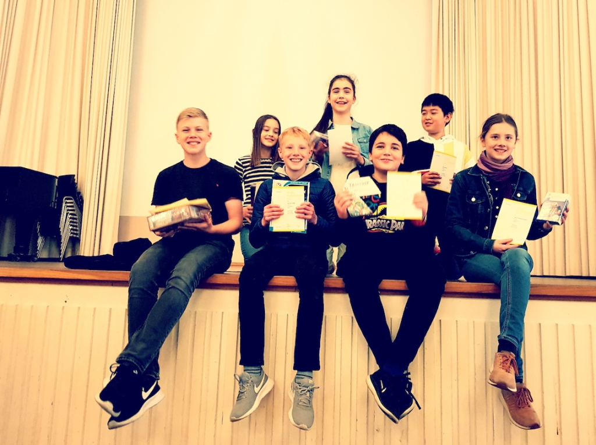

*hier unten noch einsetzen: Foto zu "Känguru-Wettbewerb 2023" (Seite 80, Jahrbuch 2022/23)*

*hier einsetzen: Fotos zu "MINT-Exkursion Henkel Klasse 6c am 2.2.2023" (Seite 33-35, Jahrbuch 2022/23)*

*hier einsetzen: "Jungend forscht" (Seite 36-37, Jahrbuch 2022/23)*

*hier einsetzen: "Die "Ab-ins-Beet-AG" startete ab in die Carbon-Challenge" (Seite 92, Jahrbuch 2022/23)*

## bio-logisch!

Erstmalig nehmen die Schülerinnen und Schüler aus der AG MINT an dem **bio-logisch! Wettbewerb** teil. Dieses Jahr erforschen die Schülerinnen und Schüler unter dem Motto „ohne Moos nix los“ den Aufbau von Moos, sowie Moos als Lebensraum für Tiere. Unterschiedliche Experimente ermöglichen den Schülerinnen und Schülern forschend-entdeckend zu arbeiten. Dadurch erschließen sie sich neue Erkenntnisse in der Biologie. Dieser Wettbewerb soll nicht nur Spaß machen, sondern wir erhoffen uns, durch gute Ergebnisse, einige der tollen Preise zu gewinnen.

## Känguru Wettbewerb

### Känguru-Wettbewerb 2023

Allen Grund zur Freude boten die tollen Leistungen, die unsere Schülerinnen und Schüler beim diesjährigen Känguru-Wettbewerb im Fach Mathematik erzielten! Damit reihten sie sich ein in die große Zahl von über 827.000 Schüler/innen in Deutschland, die sich ebenfalls am 16. März den vielfältigen Knobel-, Rechen- und Logikaufgaben stellten.

Weltweit erfreut sich der Wettbewerb ebenfalls weiterhin großer Beliebtheit - mehr als 6 Millionen Teilnehmer/innen in über 80 Ländern treten hier jährlich an. Von den 334 Luisen-Schüler/innen gewannen Jonas Hilden, Laurens Treffer (beide 6a), Lukas Güldner (5a) und Zixuan Zhao (8c) einen 3. Preis. Markus Klammert und Simon Bell (beide 9a) erreichten einen 2. Preis. Den Preis für den größten Känguru-Sprung an unserer Schule konnte Gina Ratgeber (7c) für sich entscheiden. Ihr gelang die größte Zahl richtig gelöster Aufgaben in Folge. Mathematische Glückwünsche an alle Preisträger/innen!

Christina Riemen

*hier einsetzen: Foto zu "Känguru-Wettbewerb 2023" (Seite 80, Jahrbuch 2022/23)*

### Känguru 2022
Dass es auch und gerade in Corona-Zeiten Spaß macht, sich mit kniffligen Aufgaben und Problemen aus der Welt der Mathematik zu beschäftigen, stellten 97 Schülerinnen und Schüler unserer Schule unter Beweis, die von zu Hause aus

über unsere neue Lernplattform am diesjährigen Känguru-Wettbewerb teilnahmen. Insgesamt 18 Schüler/innen erreichten dabei mehr als 100 Punkte. Besonders starke Ergebnisse erzielten dabei Julius (5b) und Joshua (5c) aus der Erprobungsstufe (s. Foto), Pawel (7a) und Samuel (7c) aus der Mittelstufe sowie Sandro, Paul, Clemens (alle EF) und David (Q1) aus der Oberstufe.  
Allen einen herzlichen Glückwunsch!

### Känguru-Wettbewerb 2019

Gemeinsam mit inzwischen mehr als 6 Millionen Schülerinnen und Schülern in fast 80 Ländern weltweit nehmen auch wir am Luisen-Gymnasium seit vielen Jahren am Känguru-Wettbewerb teil.

Beim Känguru-Wettbewerb handelt es sich um einen mathematischen Multiple-Choice-Wettbewerb, der jährlich am 3. Donnerstag im März stattfindet und seine Wurzeln im Heimatland der Kängurus hat. Dabei gilt es vielfältige mathematische Aufgaben zu lösen, deren Lösung mal kniffelig, mal spaßig und mal überraschend ist.

Im Jahr 2019, dem Jubiläumsjahr des Känguru-Wettbewerbs (25 Jahre), haben 262 Schülerinnen und Schüler unserer Schule aus den Jahrgangsstufen 5-Q1 geknobelt, gerechnet und geschätzt – und das sehr erfolgreich!

Simon, Tabea (Jgst. 5), Oskar (Jgst. 6) und Denis (Jgst. 7) konnten sich über 1. Preise, Florinda, Hyun Jung (Jgst. 5) und Lauri (Jgst. 6) über 2. Preise und Janna (Jgst. 6) über einen 3. Preis freuen.

Oskar gelang außerdem mit den meisten in Folge richtig gelösten Aufgaben der „weiteste Kängurusprung“.

Wir gratulieren allen ganz herzlich!

*hier einsetzen: "Die "Ab-ins-Beet-AG" startete ab in die Carbon-Challenge" (Seite 92, Jahrbuch 2022/23)*

## 

## MINT-Arbeitsgemeinschaft 3malE

***„Pascal trifft Volt“***

*Amira, Till, Benedikt, Paul, Clemens und – leider an dem Tag fehlend – Sandro*

*Wir hatten zwei Ideen, wie der auf die Druckplatten wirkende Druck zur Stromerzeugung genutzt werden könnte. Entweder könnte der Druck über einen Stempel und von dort über eine am Stempel befestigte Zahnstange und ein Zahnrad auf die Achse eines Dynamos übertragen werden. Der vom Dynamo erzeugte Strom könnte dann z.B. für eine Lampe verwendet werden. Oder wir übertragen den Druck mit Hilfe einer Hydraulik so auf einen Magneten, dass der Magnet durch eine Kupferdrahtspule geschoben wird und in der Spule so ein Strom induziert wird. Der Strom kann auch hier eine Lampe zum Leuchten bringen. Zu beiden Ideen haben wir einen kombinierten Prototyp gebaut.*

***„Muskelkraft gibt „Handy“ Saft“***

*Hendrik, Lilia, Johanna, Imke, Sarah, Moritz, Philipas, Simon, Sophie, Sara, Bella*

*Von Anfang an hatten wir uns zwei verschiedene Bewegungen überlegt, um den Strom zu erzeugen. Wir wollten einen Dynamo, wie wir ihn von unseren Fahrrädern kennen, mit Sportgeräten verbinden. Bei diesen Sportgeräten muss die Bewegung wie bei einem Kreislauf aussehen, also zum Beispiel wie bei einem Laufband. Die andere Bewegung sollte eine Hin-und-Her-Bewegung sein. So etwas gibt es bei einer Wippe oder bei einer Schaukel. Um den Strom zu erzeugen, muss durch die Bewegung ein Magnet durch eine Drahtwicklung bewegt werden. In der Drahtwicklung, man nennt das eine Spule, entsteht dann durch die Magnetkraft ein Strom. Das nennt man Induktion. Durch beide Bewegungen wollten wir eine Lampe zum Leuchten bringen. Zu beiden Ideen haben wir je einen Prototyp gebaut.*

Teilnahme am Wettbewerb 3malE

Die Firma innogy SE hat in Zusammenarbeit mit ZDI (Zukunft durch Innovation), Jugend forscht und TUF (Technik-Unterricht: Forum) einen Energie-Wettbewerb mit Namen „3malE“ ausgeschrieben. Ziel des Wettbewerbs ist es, Schülerinnen und Schülern eine Plattform zu bieten, sich mit Energie-, Umwelt- und Technikthemen auseinanderzusetzen und sie so für den schonenden Umgang mit natürlichen Ressourcen zu sensibilisieren. Darüber hinaus sollen Kreativität, interdisziplinäres Denken und fächerübergreifende Zusammenarbeit gefördert werden. Für diesen bundesweiten Wettbewerb haben interessierte Schülerinnen und Schüler der Stufen 5 und 6 bzw. 8 und 9 je einen Projektvorschlag eingereicht. Zu unserer großen Freude haben es beide Vorschläge in die Auswahl der 120 Vorschläge aller Schulen in Deutschland geschafft. Die beiden Projekte tragen die Titel „Muskelkraft gibt „Handy“-Saft“ bzw. „Pascal trifft Volt“. Für die Bearbeitung der Projekte, die am Mittwoch, dem 20.2.2019 (Stufe 8 und 9), bzw. am Montag, dem 25.2.2019 (Stufe 5 und 6), jeweils um 13.40 Uhr in Raum 205 startet, stellt der Ausrichter jeweils 500 € zweckgebundene Mittel bereit. Die Schule verpflichtet sich im Gegenzug zur Bearbeitung der Projekte sowie zur Abgabe eines Abschlussberichts bis zum 13. Mai 2019.

## Exkursion zum Raumfahrtzentrum

Exkursion zum Deutschen Luft- und Raumfahrtzentrum

Am 26. Februar 2019 besuchten 12 Schüler/innen zusammen mit Herrn Lieber das Deutsche Luft und Raumfahrtzentrum (DLR) in Köln. Während unseres Besuches haben wir verschiedene Experimente durchgeführt und uns verschiedene Vorträge zum Thema Raumfahrt angehört.

Zunächst hat uns Dr. rer. nat. Richard Bräucker eine Einführung in vergangene Raumfahrtprojekte gegeben und uns erklärt, wie weiter vorgegangen wird.

Im Anschluss daran haben wir uns in Gruppen von bis zu vier Schüler/innen aufgeteilt. In diesen Gruppen haben wir dann an verschiedenen Stationen Experimente zu unterschiedlichen Themen durchgeführt. Zum Beispiel ein Experiment zu der Frage, ob Individuen die Gravitation der Erde wahrnehmen.  
Leider konnten wir nur drei Experimente durchführen. Zum Abschluss der Experimentierphase nahmen alle Gruppen an einem großen Experiment, der Kometensimulation, teil.

Bei dem Experiment zum Thema Kometensimulation wurde aus einer wässrigen Lösung, Gesteinspulver und Ruß eine künstliche Kometensubstanz hergestellt, diese würde dann mithilfe einer künstlichen Sonne in einer Vakuumkammer bestrahlt.

Ein weiteres Experiment gab es zu der Frage, ob Menschen oben und unten erkennen und auf die Schwerkraft reagieren oder sich nach anderen Reizen richten. Dafür stellten wir verschiedene Hypothesen auf und  überprüften diese. Mit einer Videokamera wurden das Schwimmverhalten von Pantoffeltierchen aufgezeichnet und mit einem Computerprogramm ausgewertet.

Ein drittes Experiment wurde zum Thema Werkstoffe durchgeführt. Dabei wurde die Beschaffenheit von verschiedenen Stoffen im einer Fallvorrichtung untersucht und im Anschluss ausgewertet.  
Am Nachmittag gab es eine Führung durch die Trainingsstation der Astronauten/innen. Dort üben sie zum Beispiel in einem Schwimmbad, wie es ist, sich in der Schwerelosigkeit fortzubewegen und in dieser Reparaturen an der Raumstation durchzuführen.

Außerdem schilderte man uns Grundvoraussetzungen für eine Laufbahn als Astronaut, wie die Mindestgröße, und zeigte uns bereits im Einsatz befindliche Modelle, wie Sonden.

Insgesamt war der Besuch im deutschen Luft- und Raumfahrtzentrum nicht nur informativ, sondern auch sehr interessant und sicher einen weiteren Besuch wert.

## Kurse am ZIES

(Zentrum für innovative Energie-Systeme)

### UNESCO-Säule „Bildung für nachhaltige Entwicklung“ – Exkursion der 9c an die Hochschule Düsseldorf

Im Rahmen der UNESCO Stunde hat sich die Klasse 9c mit dem Thema Nachhaltigkeit und Energie befasst. Die Schülerinnen und Schüler haben in der Schule Temperatur, Licht und Stromverbrauch in verschiedenen Räumen gemessen und entwickeln auf dieser Grundlage Tipps und Ideen zum Energiesparen.

In Kooperation mit der Hochschule Düsseldorf nahm die Klasse am Projekttag „Energiewende macht Schule“ teil. Nach einer einführenden Probevorlesung konnten die Lernenden durch Experimente und Rätsel ihr Wissen aktiv anwenden und erweitern. Außerdem hatten sie die Möglichkeit an Planspielen zum Thema Energieverbrauch/ Energiesparen teilzunehmen. Besonders das Spiel „Keep cool“, bei dem der Klimawandel anhand der Energiepolitik einzelner Staaten und Regionen der Erde thematisiert wird, hat den Schülerinnen und Schülern viel Spaß gemacht.

Wir bedanken uns für die Zusammenarbeit mit dem netten Team der Hochschule Düsseldorf und hoffen, dass wir im nächsten Schuljahr vielleicht im Rahmen einer „Energie-Spar-AG“ und in Projekten rund um die UNESCO-Säule „Bildung für nachhaltige Entwicklung“ das Thema Energiewende noch weiter voran bringen können.

### Physik im Schülerlabor

Im Rahmen der Projektwoche waren Schüler unserer Schule am Zentrum für Innovative Energiesysteme der Hochschule Düsseldorf zu Gast. Dort hatten sie die Möglichkeit, das neu eingerichtete Schülerlabor nutzen zu können.

Zu diesem Projekt ist nun ein informativer Artikel mit Bildern erschienen, in DUSmomente, dem Magazin des Airports Düsseldorf.

### Projekt Jahrgangsstufe 9: Dem Klimawandel auf der Spur / Die Kraft der Sonne nutzen

20 Schülerinnen und Schüler der Jahrgangsstufen 9 widmeten sich den beiden Themen in Zusammenarbeit mit der Hochschule Düsseldorf und dem Netzwerk MINT Düsseldorf (zdi).  
Zwei Tage lang forschte die Gruppe im Schülerlabor der Hochschule anhand von Experimenten, Präsentationen, Quizfragen und einem Planspiel zu den o.g. Themen. Beim anschließenden Präsentationstag am 12. Oktober 2018 wurden die Ergebnisse in der Schule vorgestellt. Hier konnte z.B. jeder Interessierte seinen eigenen ökologischen Fußabdruck ausrechnen, um zu sehen, wieviel er selbst durch seine Lebensweise dazu beiträgt, dass Konsum und Lebenswandel sich direkt auf das Klima unserer Erde auswirken. Das Planspiel Keep cool verdeutlichte die Folgen für die Weltbevölkerung und schärfte den Blick dafür, eigenes politisches Handeln im Kontext von Ressourcen unserer Erde und dem Zusammenspiel zwischen wirtschaftlichen Prozessen und dem Schutz unserer Erde in den Blick zu nehmen.

## Jugend forscht

### 2022/23

*hier einsetzen: "Jungend forscht" (Seite 36-37, Jahrbuch 2022/23)*

### Jugend forscht fördert Nachwuchstalente

Wir nahmen 2018 über unseren Projektkurs “Jugend forscht” als Dreiergruppe am Wettbewerb teil. Am schwierigsten war es, ein geeignetes Thema für unser Forschungprojekt zu finden. Als wir endlich unser Thema gefunden hatten, ,,Das Meidungsverhalten von Schleimpilzen”, entwickelten wir mit großer Motivation Versuchsaufbauten, um klare Ergebnisse für unsere Fragestellungen zu erzielen. Im Verlauf des Projektkurses traten verschieden Schwiergigkeiten beim Züchten des Schleimpilzes auf. In der Schule ist es noch niemanden gelungen Schleimpilze zu  züchten, deswegen konnte uns auch niemand dabei helfen. Für uns war dies eine neue Erfahrung, weil wir zum ersten Mal in einem Unterrichtsfach die Möglichkeit bekamen, selbstständig  zu arbeiten und zu experementieren. Natürlich waren wir nicht auf uns allein gestellt. Wir bekamen viele Hilfestellungen bei unterschiedlichen Schritten unsere Forschung.  Bis zur Zulassung unsere Projektpräsentation bei “Jugend forscht” mussten wir verschiedene Hürden überwienden, wie das Schreiben unserer Projektarbeit, die ca. 12 Seiten lang war. Nach dem ganzen Stress wurden wir dann zum Wettbewerb zugalssen. Am Projekttag stellten wir dann unsere sechs monatige Arbeit einer Biologie - Fachjury vor. Wir waren dabei sehr nervös, da wir noch nie etwas vor einem Fachpuplikum vorstellen mussten sowie im Anschluss der Öffentlichkeit. Doch unsere lange Arbeit hat sich gelohnt. Wir haben einen Sonderpreis in Höhe von 100 Euro gewonnen. Außerdem haben wir durch den Wettbewerb gelernt uns und unsere Arbeit selbstbewusst zu präsentieren. Nach der Feierstunde konnten wir zufrieden mit unserer Leistung nach Hause gehen.

***Jugend forscht 2017 - ein Erfahrungsbericht***

*Im März 2017 nahm ich zusammen mit meinen Teamkollegen Jaria Bukhari und Paul Clemens am 50. „Jugend-forscht“ Landeswettbewerb teil.*

*Wie zu vermuten, handelt es sich bei „Jugend forscht“ (abgekürzt „Jufo“) um einen Wettbewerb für wissensbegeisterte Schülerinnen und Schüler, beziehungsweise Jugendliche bis 21 Jahre. Es geht darum, in einem der Bereiche Mathematik, Informatik, Technik, Geo- und Raumwissenschaften, Physik, Biologie, Chemie und Arbeitswelt zu forschen und bei Heranwachsenden Interesse für die Wissenschaft zu wecken. Meine Gruppe und ich untersuchten das Wachstum von Kannenpflanzen unter Einfluss von den vegetarischen Proteinquellen Hanfproteinpulver, Tofu und Joghurt im Teilgebiet Biologie.*

*Eine Jury begutachtet diese Projekte nach einiger Arbeitszeit während des „Landeswettbewerbs“. Diese Jury besteht aus drei bis fünf sich mit den Forschungsbereichen beschäftigenden Wissenschaftlern oder Lehrern, welche die verschiedenen Langzeitexperimente mit Betracht auf einen praktischen Nutzen, Originalität sowie Kreativität bewerten.*

*Am besagten Tag trafen sich an die 100 Schüler/-innen aus ganz Düsseldorf zusammen mit den Veranstaltern in einem Saal der Rheinbahn, die den Wettbewerb dieses Jahr finanziell unterstützten. Der Raum erinnerte an einen typischen Vorstellungsraum für Wissenschaftswettbewerbe aus amerikanischen Filmen, inklusive kleiner Tische und Pinnwände, an welchen die ca. 50 „Jufo“- Gruppen ihre jeweiligen Projekte vorstellen konnten. Da der ganze Tag zum Präsentieren geplant war und die Juroren die Stände nacheinander besuchten hatten die restlichen Schüler viel Zeit, sich die anderen Stände und Ideen anzuschauen, was mitunter sehr interessant war. So gab es einen Teilnehmer, der sich trotz seines sehr jungen Alters eigenständig mit Informatik, Mechanik und Photovoltaik auseinandersetzte, um eine sich der Sonne zuwendende Solarzelle zu konstruieren und auch einen Prototypen vorzustellen. Ein anderer Jungforscher entwickelte wiederrum eine mathematische Formel, welche die Umrechnung von Brüchen in Dezimalzahlen erleichtert.*

*Basierend auf meinen persönlichen Erfahrungen kann ich eine Teilnahme an „Jugend forscht“ empfehlen. Sie bietet viele Vorteile, allen voraus das eigenständige und intensive Auseinandersetzen mit einem selbsterwählten Thema, das einen optimalen Einblick in das wissenschaftliche Arbeiten gewährleistet. Frau Blöcker, der ich an dieser Stelle nochmals danken möchte, betreut die Projekte und half uns tatkräftig.*

***Glück im Unglück - Ein Erfahrungsbericht***

*Und schon wieder hier gelandet. Nach einem erfolgslosen Jahr beim Jugend-Forscht Wettbewerb 2017 nahm ich am Jugend forscht Projektkurs teil.*   
*Ich musste, da ich mit der unteren Stufe zusammenarbeiten musste, alleine arbeiten und mein Projekt selbständig koordinieren. Mein Projekt benötigte ein Aquarium und Fische, die schwer zu besorgen waren. Das Verhalten der Tiere war inkongruent mit meiner ursprünglichen Hypothese, was mich leicht zur Verzweiflung trieb.*

***Was sollte ich tun?***  
*Frau Blöcker motivierte mich, mein Projekt fortzuführen und zu Ende zu bringen. Obwohl ich Schwierigkeiten mit der Koordination meiner Arbeit, Klausuren und keine Hoffnung hatte, habe ich das Beste aus der Situation gemacht und.....*

***Ta-da!**** Ich gewann einen Sonderpreis, da ich die Verhaltensforschung an Fischen vorangetrieben habe. Um ansatzweise meine Gefühle auszudrücken, könnte man sagen, ich hätte einen Nobelpreis gewonnen. Letztes Jahr hatte ich nichts und ging enttäuscht nach Hause und 2018 hatte ich alles, was ich mir hätte vorstellen können, gewonnen.*

*Letztendlich kann ich es nur weiterempfehlen, weil man lernt Verantwortung zu übernehmen, eine eigene Idee zu realisieren und mit einer spontanen Situation umzugehen.*

*Jaria Bukhari und Safae El Khattabi*

## Kurse an der HHU

Im Schuljahr 2018/19 absolvierten vier Schüler/innen einen Halbtagskurs im Schülerlabor Chemie.

### Faszinierendes Eisen

Am 3.7.2019 fuhren Kara, Bela und Hicham (alle EF) mit der U73 zum Schüler-Chemie-Workshop an der Heinrich-Heine-Universität. Dort wurden die drei und sieben Schüler/innen anderer Düsseldorfer Schulen von Herrn Prof. Dr. Ganter begrüßt und in die Thematik des Workshops „Eisen und seine Komplexchemie“ eingeführt. Bei diesem halbstündigen Frage/Antwort-Teil haben sich alle drei sehr kompetent beteiligt (um so trauriger ist es, dass nur einer von ihnen Chemie als LK gewählt hat ☹). Danach wurde die Gruppe von drei Mitarbeiter/innen aus dem Arbeitskreis von Herrn Prof. Dr. Ganter ins Labor begleitet. Dort gab es zuerst einmal Schutzbrillen und Kittel, wie sich das in einem Labor gehört. Die dann folgenden Aufgaben bestanden in der Herstellung mehrerer farbiger Eisen-Komplex-Lösungen, dem Ansetzen einer Lösung mit unbekanntem Eisen-Gehalt sowie dessen Bestimmung mittels Redoxtitration. Wie man auf den Fotos sieht, sind die drei das sehr konzentriert angegangen und haben auch den praktischen Teil gemeistert. Alle, die jetzt für sich feststellen, dass sie so etwas auch einmal gerne machen möchten, sei schon verraten, dass es auch im nächsten Schuljahr wieder einen solchen Workshop ab Klasse 9 geben wird, dann in Chemie und in Physik.“

## Zu Besuch bei Henkel

### MINT-Exkursion Henkel Klasse 6c am 2.2.2023

*hier einsetzen: Fotos zu "MINT-Exkursion Henkel Klasse 6c am 2.2.2023" (Seite 33-35, Jahrbuch 2022/23)*

### MINT-Kurs 6 bei der Forscherwelt Henkel

Am Donnerstag, den 9.6.2022 haben wir im Rahmen des MINT-Unterrichts einen Ausflug zum Schüler/innen-Labor „Forscherwelt“ bei der Firma Henkel in Düsseldorf Holthausen unternommen. Wir haben uns um 8:15 an der Schule getroffen, und sind nach längerer Fahrt mit überfüllten Bahnen vor Ort angekommen.

Wir wurden vor dem Besuchertor von Frau Dr. Krupp in Empfang genommen und in den Raum der „Forscherwelt“ geführt. Die ungewöhnliche Garderobe bestand aus vielen „Tropfen“, in die wir  unsere Taschen und Jacken verstauen sollten. Ich glaube keiner hätte geglaubt, dass alles in einen kleinen Tropfen passen würde, aber das hat es wirklich!

Zunächst hat uns Frau Krupp über unser Forschungsthema informiert: „Klebstoffe“.  
Im Labor haben wir dann viele Experimente im Zusammenhang mit Stärke gemacht: wir haben nämlich Lebensmittel auf Stärke getestet (mit Iod-Kalium-Iodid) und Stärke sowie Kleber selber hergestellt.  
Stärke selbst haben wir hergestellt, indem wir Kartoffeln mit einer Reibe gerieben, das dann mit Wasser vermischt und auf ein Tuch gelegt haben. Dann haben wir den Saft ausgepresst, den Auspresssaft 5 Minuten stehen lassen und danach das gelbe Kartoffel-Wasser weggekippt. Unten hat sich eine weiße Schicht gebildet, die wir anschließend in eine Schüssel geschüttet und bei 180 Grad in den Ofen getan haben.  Wenn man das nach einer Zeit aus dem Ofen geholt hat, hat sich Stärke gebildet. Selbst Kleber haben wir hergestellt, indem wir 1 Gramm Stärke mit 5 ml Wasser vermischt und rührend auf ca. 70 Grad Celsius erhitzt. Nach einer kurzen Zeit hat sich dann Kleber gebildet. Insgesamt fanden alle den Ausflug gut und interessant, aber das Beste war eine kleine Höhle in der man sitzen konnte.

Eleanor Chami

Im Januar 2019 sowie im Dezember 2019/Januar 2020 besuchten die Differenzierungskurs Naturwissenschaften an zwei Tagen das Schülerlabor unseres Kooperationspartners Henkel und konnten dort ganztägig Versuche zu Waschmitteln und deren Waschwirkung durchführen.

Schülerbericht von einer Exkursion des Chemie Leistungskurses der Jahrgangsstufe Q1

### Die Prittstift-Produktion im Henkel-Werk Düsseldorf Holthausen

Am 3. Juli 2018 unternahmen wir - der kleine Chemie LK Q1 von Herrn Püttmann - eine Exkursion zur Klebestiftproduktion von Henkel. Wir trafen uns am Morgen an der U-Bahn-Haltestelle in Holthausen und gingen dann gemeinsam die wenigen Schritte zum Haupteingang des Henkel-Werkes. Dort wurden wir mit einem Besucherausweis ausgestattet und betraten dann das Firmengelände. Da die Klebestiftproduktion am anderen Ende des Werksgeländes liegt, wurden wir dort mit zwei Autos hingefahren. Für Herrn Dr. Schroeder, den Leiter des Labors für Produktentwicklung, waren wir die erste Besuchergruppe in seiner Karriere. Und wir müssen sagen, er hat sich mächtig ins Zeug gelegt und uns ein interessantes und abwechslungsreiches Programm geboten. Zunächst hat er uns bei Kaffee und Plätzchen von seinem beruflichen Werdegang erzählt. Er hat früher selbst an seiner Schule einen Chemie LK besucht und so schon früh die Weichen in Richtung Chemische Industrie gestellt. Dann hat er uns sein Labor gezeigt. Hier konnten wir alles über Prittstifte erfahren. Zum einen, wie viele verschiedene Arten von Klebestiften überhaupt produziert werden und welche Neuentwicklungen es in letzter Zeit gab (z.B. Prittstifte in Neonfarben oder mit Glitter, was insbesondere Kinder ansprechen soll). Die Chemie des Klebens stand ebenso im Fokus seiner Erklärungen wie die Probleme, die man für den Einsatz eines Klebstoffes im Alltag bedenken muss. Der Klebestift darf nicht zu schnell austrocknen, er muss für Kinderhände geeignet sein und muss daher auch gefahrlos gegessen werden können, was Herr Dr. Schroeder uns aber nicht empfiehlt...

Anschließend besichtigten wir das Forschungslabor. Hier zeigte uns der Leiter dieses Labors voller Stolz und Begeisterung verschiedene Projekte, an denen seine Arbeitsgruppe derzeit tüftelt. Ob Klebstoff, Tapetenkleister oder Silikonabdichtung für die Duschkabine, jeder Mitarbeiter hatte hier irgendeinen Forschungsauftrag und hat uns diesen vorgestellt. Da die Mitarbeiter des Labors ganz unterschiedliche Ausbildungen durchlaufen haben, stand auch das ein wenig im Fokus, da wir ja auch die verschiedenen Berufsfelder in der chemischen Industrie kennen lernen wollten. Ob Chemielaborant, duale Studentin oder promovierter Chemiker, alle arbeiteten hier Hand in Hand.

Zum Abschluss unseres Besuches wurde uns dann noch die Abfüllanlage für die Prittstifte gezeigt. Mit Warnwesten und Sicherheitsschuhen ausgestattet betraten wir die große Produktionshalle und bekamen dort vom Produktionsleiter die Maschinen erklärt. Jede Maschine wurde individuell gefertigt. Aus großen Tanks werden über Rohrleitungen die Klebstoffbestandteile und Zusätze in die Maschinen geleitet. Dort werden die Rohlinge mit der noch flüssigen Klebstoffmasse befüllt und anschließend gekühlt, bevor sie in riesige Kartons hineinfallen. Diese Anlagen laufen teilweise im 24-Stunden-Takt, wenn es einen großen Bedarf an Klebestiften gibt, wie es immer vor Beginn eines neuen Schuljahres der Fall ist, wenn in allen Geschäften und Büromärkten "back to school" Aktionen laufen.

Leider ohne Prittstift oder Schutzbrille als Geschenk, aber um eine große Erfahrung reicher, wird dieser Tag uns lange in Erinnerung bleiben.

## Besuche beim BayLab

### 2019

### Bio GK (Q1) im Baylab Schülerlabor in Wuppertal

Am Mittwoch, den 17.04.19, besuchten die Schülerinnen und Schüler des Biologie-Grundkurses der Qualifikationsphase 1 das Schülerlabor Baylab in dem Bayer Pharma Forschungs- und Entwicklungszentrum in Wuppertal.  
Ziel des Ausfluges war es, dass die Schülerinnen und Schülern einen Einblick in das naturwissenschaftliche Arbeiten bekommen und selber ihr theoretisches Wissen über die Genetik sowie wissenschaftliche Arbeitsmethoden der Genetik nun auch einmal in der Praxis erfahren durften. So sollten sie in Kleingruppen anhand der DNA verschiedener Mitglieder einer Familie und unter Anwendung der Polymerasekettenreaktion (PCR) und der Gelelektrophorese herausfinden, welche der Familienmitglieder von der Stoffwechselerkrankung Neuronale Ceroid-Lipofuscinose, kurz NCL, betroffen sind. Die Schülerinnen und Schüler erhielten zunächst Informationen über die größtenteils noch unbekannte Krankheit, welche zur Degeneration des Nervensystems führt, was sich wiederum in verminderten geistigen und körperlichen Fähigkeiten widerspiegelt. Diese Krankheit basiert auf einem vererbbaren Gendefekt.  
Der Tag wurde in verschiedene Arbeitsschritte gegliedert, sodass die Schülerinnen und Schüler nach einer ausgiebigen Pipettierübung zur Verbesserung der Feinmotorik selber PCR-Ansätze anfertigen mussten. Während die DNA in der PCR vervielfältigt wurde, konnte die Zeit für eine Mittagspause genutzt werden. Im Anschluss bereiteten die Schülerinnen und Schüler eigenständig das Gel für die Gelelektrophorese vor und befüllten die darin vorhandenen Kammern mit ihren DNA-Ansätzen. Der letzte Arbeitsschritt bestand darin, die eigenen Gelelektrophoresebilder auszuwerten und das „Genom“ der verschiedenen Familienmitglieder zu bestimmen bzw. eine Aussage bezüglich einer möglichen Erkrankung zu treffen. Fast alle Gruppen hatten hier eindeutige Ergebnisse, was auf eine präzise Vorgehensweise ihrerseits zurückzuführen ist.  
Da an diesem Tag im gleichen Gebäude die Auszubildenden des Fachbereiches Biologie Ratten sezierten, um Organe zu lokalisieren sowie die Arbeitstechniken einzuüben, hatten unsere Schülerinnen und Schüler die Möglichkeit, ihnen dabei zuzusehen und Fragen zu stellen. Dies stellte einen sehr interessanten Abschluss eines arbeitsreichen und äußerst erkenntnisreichen Tages dar.

Pia Engelberty, Maja Bsaisou

### 5c besucht das Schülerlabor

Kaum an der neuen Schule angekommen, stand für die Klasse 5c am Montag, 02.09.2019 auch schon die erste gemeinsame Aktion an: eine Exkursion zum Baylab, dem Schülerlabor von Bayer in Leverkusen.   
Dort gingen die Schülerinnen und Schüler als wissbegierige Nachwuchsforscher der Frage nach, was denn genau alles im eigenen Frühstücksbrot drin steckt.

Dazu sollten sie zunächst eigene Vermutungen aufstellen, welche Nahrungsmittel Kohlenhydrate, Fette, Proteine oder Vitamine enthalten. Diese Vermutungen wurden dann in den jeweiligen Forscherteams mit Hilfe verschiedener Experimente

überprüft. Da wurde eifrig  geschnitten, gerieben, pipettiert, angefärbt, umgeschüttet, beobachtet, beschrieben, verglichen … und zum Schluss alle Ergebnisse im Forscherheft festgehalten.

Alle haben konzentriert geforscht und wir hatten großen Spaß, in einem Labor naturwissenschaftlich zu arbeiten. Das war ein toller erster Ausflug und ein schönes gemeinsames Erlebnis. (Text: U. Hübethal; Bild: Luisen-Gymnasium/Hüb)

### 2017
### Erbgut und Gesundheit - Methoden der Biotechnologie
### Eine Exkursion ins Baylab in Leverkusen

Am 15.09.2017 trafen sich schon früh am Morgen die Biologiekurse der Q1 am Düsseldorfer Hauptbahnhof. Es stand eine Exkursion in das Baylab in Leverkusen an.  
In Laborkitteln und Namensschildern ausgestattet begannen wir Schritt für Schritt die Durchführung einer Polymerase-Kettenreaktion (PCR). Zu einer der vielen ausgeführten Schritte gehörte beispielweise das Extrahieren der eigenen DNA aus den Mundschleimhautzellen, welche wir für den gesamten Vorgang verwendet haben. Selbstständig durften wir unter Anleitung und anhand unseres bereits im Biologieunterricht erlangten Wissens einen besonderen Bereich auf einem unserer Chromosome vervielfältigen.

Besonders aufregend war es, als wir für einen kurzen Moment unsere eigene DNA mit bloßem Auge erkennen konnten. Zum Schluss haben wir das PCR-Produkt mithilfe einer besonderen Methode nachgewiesen und mit denen unserer Mitschüler verglichen.  
Es war besonders spannend einmal persönlich zu erleben, was sonst immer nur in den Biologiebüchern zu lesen ist.

Hinzuzufügend war es bemerkenswert, selbst den Prozess welcher durchgeführt wird, wenn DNA-Spuren an einem Tatort gefunden werden, selbst zu durchleben.  
Wer weiß? Eventuell findet einer von uns seinen Traumberuf in der Spurensicherung!

Rahel Addai-Mmunumkum, Q2

### 2016

Am 15. September 2016 machten wir, der Bio LK von Frau Patten zusammen mit einigen Schülern aus der Q2, eine Exkursion ins Baylab, dem Schülerlabor der Firma Bayer.

Der Tag fing damit an, dass wir uns um 8:15 Uhr vor der Schule trafen, um gemeinsam mit dem Bus zur Bayer zu fahren. Wir wurden dort von einer netten Frau empfangen, die uns ab dann den ganzen Tag begleitete. Sie war Wissenschaftlerin.  
Der Plan für den Tag war, eine Gelelektrophorese durchzuführen und unsere eigene DNA zu untersuchen. Zuerst erklärte uns die Wissenschaftlerin, was eine Gelelektrophorese ist und wie diese abläuft. Mit ihr wiederholten wir, was wir im Unterricht über die DNA und dessen Replikation gelernt hatten, sodass wir eine feste Grundlage hatten, um die Abläufe des kommenden Tages zu verstehen. Nach ungefähr einer halben Stunde teilten wir uns in Zweier- und Dreierteams auf und gingen an die Experimentiertische, dort war schon alles für uns vorbereitet.  
Wir entnahmen DNA aus unserer Mundschleimhaut und spalteten sie von dem Rest der Zelle ab, sodass wir die isolierte DNA mit der PCR vervielfältigen konnten. Nach jedem Schritt, der dahin führte, erklärte die Frau uns die einzelnen Vorgänge und gab uns Aufgaben, damit wir selber herausfinden wie es weitergeht.

Zu Mittag wurden wir alle von Bayer zu einem Essen in der Kantine eingeladen. In der Mittagspause, während unsere DNA Proben sich im Thermocycler vervielfältigten, haben wir Zeit gehabt, die neueröffnete Ausstellung neben dem Schülerlabor zu besichtigen. Dort hat man die Möglichkeit, mithilfe moderner Technik, wie zum Beispiel Virtual Reality, die Biologie und die Welt von Bayer zu erforschen. Nach der Pause führten wir unsere Untersuchungen fort und wir bekamen alle zusätzlich zu unserer eigenen DNA noch andere Proben von einem gestellten Tatort, wo wir mit Hilfe der Gelelektrophorese das Geschlecht des Täters bestimmten sollten. Die Ergebnisse der Gelelektrophorese haben wir mithilfe eines fluoreszierenden Markers und UV-Licht sichtbar gemacht. Leider klappte es mit der eigenen DNA nicht bei allen und es entstanden nicht immer klar sichtbare Banden, aber alle konnten das Geschlecht des Täters bestimmen. Am Ende des Tages haben sie nicht nur unser Wissen vertieft und neue Erfahrungen gemacht, sondern wir sind auch als Kurs zusammengewachsen und haben uns näher kennen gelernt.

Ana Nicole Sirbu, zu dem Zeitpunkt in der Q1

## Exkursion zum KölnPub

mit dem Thema "Isolierung von Plasmid-DNA“

## Exkursionen mit Haus Bürgel

### Unsere Bioexkursionen zum Haus Bürgel 2021

Am 2. September machte unsere Klasse, die 8a, eine Bio Exkursion zur biologischen Station Haus Bürgel zum Thema „der Laubwald“. Dazu traf sich unsere Klasse um 8:00 Uhr vor der Schule und nach etwa einer Stunde Fahrt kamen wir an unserem Ziel an. Nachdem uns Norbert Tenten, Mitarbeiter der biologischen Station, begrüßt hatte, gingen wir gemeinsam zu dem sogenannten Auwald. Dort zeigte uns Norbert verschiedene Pflanzen- und Tierarten. Es war sehr interessant zu hören, dass es z.B. über 600 verschiedene Brombeerarten gibt, von denen nur die Hälfte genießbar sind. Wir haben viele verschiedene Schneckenarten kennengelernt und ein paar von uns hatten auch welche auf der Hand. Zum Schluss haben wir alle Plastikbehälter bekommen und sollten ein paar Insekten einfangen. Es waren viele Ameisen und Schnecken dabei, aber auch Mücken, Spinnen, Regenwürmer und viele mehr. Norbert hat uns viel über jede einzelne Tierart erklärt und dann haben wir die Tiere wieder an die Plätze zurückgebracht, wo wir sie hergenommen haben. Es hat sehr viel Spaß gemacht endlich mal wieder mit vielen Leuten lange draußen zu sein, da das durch Corona ja nicht ging.

Sarah&Imke (8a)

### Exkursion 2020
Am 29.10.2020 machte der Biologie-Leistungs- und Grundkurs des Luisengymnasiums eine Exkursion zum Haus Bürgel. Den Maßnahmen entsprechend fand die Exkursion im freien statt. Es ging morgens um 8 Uhr los, sodass wir gegen 9 Uhr dort sein konnten. Dort angetroffen, begrüßte uns der Exkursionsführer herzlich und führte uns durch das Naturschutzgebiet. Die initiale Frage der Exkursion war, warum Naturschutzgebiete so relevant in der heutigen Zeit sind. Während des Rundgangs durch das Naturschutzgebiet lernten wir viele neue Dinge. Beispielsweise, dass ein Teil des Waldes einmal im Jahr unter Wasser steht. Dies bezweckt, dass mehrere Arten, wie die Rotbuche, aussterben, weil die Wurzeln bereits nach einer Woche faulen.

Zudem gibt es in diesem Naturschutzgebiet einen Eisvogel, der einer hohen Sterblichkeitsrate ausgesetzt ist. Dieser muss sich von Fischen ernähren, jedoch gibt es im Winter wenige davon. Dennoch versucht der Eisvogel die Geburtenrate hoch zu halten. Nach einer Stunde kamen wir an einem Damm an, von dem wir Wasserproben entnahmen. Die Temperatur des Dammes lag bei 9 grad und der pH-Wert der entnommenen Wasserproben lag bei 6. Zudem haben wir noch etwas Erde für weitere Untersuchungen entnommen.

Außerdem zeigte uns Dr. Norbert Tenten (Exkursionsführer), dass man vieles in dem Naturschutzgebiet essen kann. So kamen Freiwillige dazu, beispielsweise Beeren oder bestimmte Samen, zu essen. Im Großen und Ganzen stellte sich die Exkursion als sehr lehrreich und spannend dar und kann nur weiterempfohlen werden.

### Biologie Exkursion 2019

Am 26.06.19 und am 01.07.19 hatten zwei Biologie Grundkurse der Q1 die Möglichkeit, das Ökosystem im Grafenberger Wald genauer unter die Lupe zu nehmen. Gemeinsam mit einem Referenten von unserem Kooperationspartner, der Biologischen Station Haus Bürgel, untersuchten die Schülerinnen und Schüler nicht nur den Baumbestand des Waldes, die Auswirkungen des Sturms Ela von vor fünf Jahren, sondern bestimmten auch Lebewesen mithilfe der Becherlupe und einem dichotomen Bestimmungsschlüssel - endlich Biologie zum Anfassen.

Engelberty

Am Mittwoch, den 04.09.2019, startete Frau Dr. Danneberg mit dem Biologie Grundkurs eine Exkursion zu der Biologischen Station Bürgel - einem Bauernhof, der neben einem kleinen Waldstück liegt. Es ging darum, neues und interessantes über das Ökosystem Wald zu lernen.

Vor Ort begann der Ausflug direkt in den Wald. Ein professioneller, promovierter Biologe leitete die Exkursion. Er führte den Kurs einen Waldweg entlang und hielt bei sämtlichen Pflanzen an, um sie dem Kurs vorzustellen und deren Eigenschaften zu erläutern. Unter den Gewächsen waren beispielsweise die Brennnessel, welche heilende Kräfte besitzt, oder andere Pflanzen, die zum Beispiel Warzen verschwinden lassen, oder sogar tödlich sind. Es wurden jedoch auch viele essbare Pflanzen gezeigt, die manche von uns gekostet haben. Der Kurs wurde auch mehrmals von dem Tour- Guide gewarnt, nicht ohne professionelle Hilfe zum essen gedachte Pflanzen zu pflücken. Nicht nur Gewächse wurden in dem Ausflug besprochen, sondern auch jegliche Kleintiere, welche zuvor von dem Kurs gefangen wurden. Da gab es bei einigen Mitschülern Probleme, weil sie sich vor den Spinnen und Insekten ekelten.

Insgesamt kann ich aber sagen, das wir Schüler des Biologie Kurses mit vielen neu gelernten Fakten über den Wald und dessen Eigenschaften zur Schule zurückkehrten.

Philipp Hoffmann

## Projekt Streuobstwiese (2017)

### Projekt Obstwiese: Vom Baum zum Saft
Frau Schaddach/ Frau Schwarzburger

Wir trafen uns in Benrath mit Dr. Norbert Tenten und er erzählte uns etwas über die Streuobstwiese.

Später sind wir zu einem der Apfelbäume gegangen und haben die Äpfel vom Baum mit Hilfe eines längeren Stabes heruntergeholt und mit Hilfe einer Obstsaftpresse zu Apfelsaft verarbeitet.

Als wir damit fertig waren, tranken wir den selbst produzierten Saft, dieser war anfangs fruchtig, danach schmeckte er zunehmend saurer. Vielleicht haben deshalb nicht alle den Saft probiert. Zum Schluss haben wir die Sachen (Gläser, Becher, Eimer, Schneidebrett,…) gewaschen.

Dann gingen wir über die Straße in die Urdenbacher Kämpe, eine Auenlandschaft. Dr. Norbert Tenten hat über verschiedenen Bäume gesprochen, die besonders in Auen wachsen, z. B. Weiden, Erlen und Pappeln. Er erklärte, wie Misteln auf den Bäumen wachsen und wie die Mistelsamen von den Vögeln von Baum zu Baum gebracht werden und diese sich dadurch vermehren. Außerdem zeigte er uns das Himalaya-Springkraut. Das ist eine aus Asien eingeschleppte Pflanze (ein Neophyt), die sich zunehmend in Deutschland verbreitet.

Das Besondere an dieser Pflanze sind ihre Früchte. Wenn man die reifen Früchte berührt, springen sie auf und die Samen werden in die Gegend geschleudert. Die reifen Samen kann man auch essen. Sie schmecken wie eine Nuss.

Dieser Tag war echt interessant.

Von Douaa Alabdin und Ahmed Alhussien

## Projekt Streuobstwiese 2018

Vom Baum zum Saft – Streuobstwiesen in der Urdenbacher Kämpe  
von Kacper Weglarz

Bilder: Liliane Bala, Imane Assajih, Meriam Ben Brahim

In der Projektwoche 2018 hat eine Gruppe der neunten Klassen einen Besuch in die Urdenbacher Kämpe unternommen. Die Urdenbacher Kämpe ist ein nicht eingedeichtes Gebiet, das deswegen regelmäßige Überflutungen durchlebt. Bekannt ist sie wegen ihrem Artenreichtum und den ausgedehnten Streuobstwiesen.  
Nach der Fahrt mit Bahn und Bus sind wir an einer schönen Wiese mit gepflegten Bäumen, hauptsächlich Apfelbäumen, angekommen.  
An einem Apfelbaum war das Highlight: wir haben mir einem Schüttelhaken die Äste geschüttelt, wo daraufhin die Äpfel von den Ästen heruntergefallen sind.  
Dann haben wir sie kleingeschnitten und in einer Obstmühle geschreddert.

Die geschredderte Apfelmasse wurde in eine Saftpresse getan und dann gepresst.

Uns hat der Apfelsaft sehr gut geschmeckt.

Als wir den Apfelsaft ausgetrunken hatten, sind wir zu einer Sielgen-Wiese gegangen, wo seltene Pflanzen wachsen, gegangen.  
Auf dem Weg dorthin hat uns Herr Dr. Tenten von der Biologischen Station verschiedenen Pflanzen und Tiere erklärt z.B. den Eisvogel. Danach neigte sich er Ausflug dem Ende zu. Uns hat der Ausflug sehr gefallen.

## Neanderthal-Museum

Besuch im Museum

Am 24.03.22 hat der Grundkurs 1 Biologie der Q2 eine Exkursion in das Neanderthal unternommen. Die Exkursion zum Thema Humanevolution ermöglichte eine vertiefende Wiederholung für das Abitur. Die Schülerinnen und Schüler haben zunächst in einem Workshop Abgüsse fossiler Menschenschädel morphologisch untersucht und ihre Einordnung in den menschlichen Stammbaum diskutiert. Im Anschluss spazierte der Kurs gemeinsam zum Neanderthal-Museum. Dort konnten die Schülerinnen und Schüler bei einer Fachführung an ausgewählten Stationen interaktiv nachvollziehen, wie nach aktuellen Erkenntnissen die Menschheitsentwicklung stattgefunden hat.

Engelberty

## Internationale Olympiade der Metropolen

### Moskau, September 2016

Im September 2016 organisierte die Stadt Moskau die erste „Internationale Olympiade der Metropolen“. Es handelt sich um einen Schüler\*innenwettbewerb in den Fächern Physik, Chemie, Mathematik und Informatik, initiiert durch den Moskauer Bürgermeister Sergey Sobyanin. Dazu wurden die 22 Partnerstädte Moskaus, aus 18 verschiedenen Ländern, eingeladen. Da Düsseldorf auch eine Städtefreundschaft mit Moskau hat, waren die Düsseldorfer\*innen durch ein 8-köpfiges Team vertreten, zusammengestellt aus den Oberstufen verschiedener Düsseldorfer Gymnasien, begleitet durch zwei Lehrer und eine Studentin der Heinrich-Heine-Universität. Das Luisen-Gymnasium war schülerseitig durch Max Schorradt (Q1, Informatik) und Jonas Leopold (Q2, Informatik) sowie lehrerseitig durch Herrn Pertschik vertreten.  
Die Olympiade wurde durch die renommierten Jurymitglieder, Professoren russischer und koreanischer Universitäten, eröffnet. Das Team nahm am ersten Wettbewerbstag am sogenannten „Blitz-Contest“ teil, in dem alle gemeinsam Aufgaben aus den vier Fächern lösen mussten, während die Antworten in Echtzeit durch das Computersystem ausgewertet wurden. Gleichzeitig konnten die Betreuer\*innen auf einer Leinwand verfolgen, wie die Teams aus den verschiedenen Städten vorankamen. Da die Aufgaben auf Englisch und auf Russisch zur Verfügung standen, nahmen auch Moskauer Schulen am „Blitz-Contest“ teil.

Alle Teilnehmer\*innen waren im Hotel „Izmailovo Delta“ untergebracht, mehrere Teams teilten sich eine Etage und einen Aufenthaltsraum. Das hat die internationale Vernetzung gut möglich gemacht. Das Düsseldorfer Team hat sich schnell mit den Schülern aus Tel Aviv angefreundet. Nach dem „Blitz-Contest“ fanden zwei Tage lang die fachspezifischen Wettbewerbe in verschiedenen Moskauer Gymnasien statt. In den Fächern Physik und Chemie war der erste Tag eine praktische Prüfung im Labor. An diesen Wettbewerben nahmen alle Teilnehmer\*innen individuell teil. Die Wettbewerbe waren anstrengend, und alle Teilnehmer gaben bis zum Schluss ihr Bestes.

## 