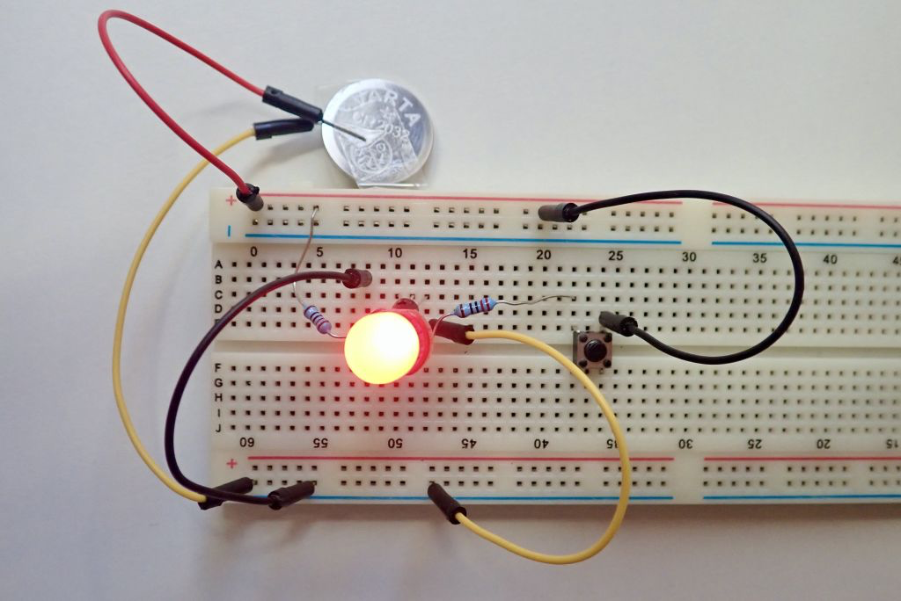

*"__Aktuelles__" und "__Archiv__" noch einfügen*

## Exkursionen

Eine wichtige Ergänzung zum Unterricht sind unsere zahlreichen und vielfältigen Exkursionen, die die verschiedenen Stufen alljährlich zu **außerschulischen Lernorte**n unternehmen. Die thematische Auswahl richtet sich nach den jeweiligen schulinternen Curricula. Fest in unserem  **MINT-Kalender** verankert sind je nach Fach gruppiert folgende Zielorte (Kooperationspartner unterstrichen):

### Biologie

Aqua-Zoo Düsseldorf, BayLab Monheim, __Biologische Station Haus Bürgel Düsseldorf__, Neanderthal-Museum Mettmann, Waldschule im Wildpark Düsseldorf

### Chemie

Forscherwelt __Henkel Düsseldorf__, Klärwerk Süd der Stadtwerke Düsseldorf

### Informatik

Coding for Tomorrow Düsseldorf

### Physik

Deutsches Luft- und Raumfahrtzentrum Köln, __Zukunft Innovative Energie-Systeme (ZIES) der Hochschule Düsseldorf__

## Projekttage

- Spezielle MINT-Themen im Rahmen unserer jährlichen Projekttage

  Der MINT-Bereich bildet einen Schwerpunkt im Rahmen unserer jährlichen Projekttage u.a. mit folgenden Themen:
  - Trinkwasser und Abwasser (inkl. Analyse und Besuch im Wasserwerk)
  - Ernährung (Untersuchung von Lebensmitteln)
  - Abfall vermeiden und verwerten
  - Physikalische Phänomene im Alltag und in den Medien
  - Mathematik & Naturwissenschaften – international & interkulturell
  - Industrie und Industriekultur in unserer Region (u.a. Besuch eines Warmbandwalzwerkes)
  - Energieversorgung – Eine globale Herausforderung.
  - Bau von Insekten-Hotels
  - Bau von Solarkochern für die Partnerschulen in Madagaskar.

    

## MINT-Facharbeiten

- Betreuung von experimentellen MINT-Facharbeiten

## MINT-Wettbewerbe

- Förderung der Teilnahme an MINT-Wettbewerben (z.B.: bio-logisch!, Chem-pions, Chemie die stimmt, Dechemax, Chemie-Olympiade, Informatik Biber, Jugendwettbewerb Informatik, Känguru, Kopfrechnen, Mathematik-Olympiade, Science League, Jugend forscht, Jugend präsentiert)

## MINT-AGs

- Freiwillige MINT-Arbeitsgemeinschaften (z.B. Jugend forscht, MINT, Ab ins Beet, Informatik/Robotik, Mathe-Büro)

### AG 3D-Druck/Robotik:

In der Robotik-AG können Schülerinnen und Schüler der Klassen 5-6 und 9-12 an individuellen Projekten arbeiten.

In den Klassen 5-6 geht es primär darum, das räumliche Vorstellungsvermögen durch kreative Problemlösung zu schulen. Mit der Software Tinkercad, welche verschiedene einfache geometrische Körper zur Verfügung stellt, gilt es komplexe Objekte zu erstellen. Anschließend werden diese mithilfe des schuleigenen 3D-Druckers gedruckt, so dass sich die Teilnehmer/innen über ein reales Produkt in ihren Händen freuen können.  
Neben kleinen Geschenken für Freunde, Familie und sich selbst gibt es auch immer wieder größere Projekte, wie bspw. das Erstellen eines Luftballonautos, welches anschließend bei einem Wettrennen zum Sieger gekürt werden kann.

In den Klassen 9-12 haben sich die Schülerinnen und Schüler im  Schuljahr 2018/19  entschieden, ein selbstfahrendes Auto zu entwerfen. Das Auto wurde zu Beginn mithilfe eines richtigen CAD Programms (Fusion 360) entworfen, und anschließend ging es darum, die Elektronik zu planen und die einzelnen Komponenten (Lenkung, Antrieb, Sensoren) mit einem Microprozessor zu steuern und zu koordinieren.

### AG MINT:

Jahrgangstufen 5-7

In dieser AG haben Schülerinnen und Schüler die Möglichkeit die Biologie mit Kopf, Hand und Herz zu erforschen. Im ersten Halbjahr haben wir zusammen herausgefunden, was Stabheuschrecken sind, wovon sie sich ernähren und wie sie leben bzw. gehalten werden. Aus diesen Informationen haben wir zusammen einen Lebensraum für Stabheuschrecken am Luisen-Gymnasium entworfen und unsere Umwelt dadurch aktiv mitgestaltet.

Weswegen wir uns für Stabheuschrecken entschieden haben liegt auf der Hand:

• Die Stabheuschrecken gehören zu den Insekten.

• Von den Stabheuschrecken gibt es verschiedene Arten, von denen wir die rotgeflügelte und die philippinische Stabheuschrecke besitzen.

• Stabheuschrecken tarnen sich sehr gut; man kann sie nur mit Mühe erkennen, weil sie wie Äste aussehen.

• Am liebsten fressen Stabheuschrecken Efeu und Brombeersträucher.

• Außerdem sind sie ganz harmlos, d.h. sie können weder beißen noch stechen.

In der AG pflegen die Schülerinnen und Schüler jedoch nicht nur die Stabheuschrecken, indem sie das Terrarium säubern, bewässern und Efeu sowie Brombeersträucher bereitstellen, sondern sie beschäftigen sich auch mit anderen biologisch-wichtigen Themen. So haben die Schülerinnen und Schüler eigene Mini-Aquarien mit Wasserpflanzen und Wasserschnecken erstellt und diese über Wochen beobachtet, untersucht und gepflegt.

Diese naturwissenschaftlichen Methoden werden im zweiten Halbjahr vertieft, da die Schülerinnen und Schüler der AG an dem Schülerwettbewerb bio-logisch! teilnehmen. Durch spannende Experimente und Versuche können sie nicht nur neue Dinge erforschen, sondern sogar etwas gewinnen!

Frau Sokolov und Lilia (2018 in der Klasse 5a)

### AG Raspberry Pi:

Vermittlung  der Funktionsweise eines Computers und verschiedener  Programmiersprachen: Programmieren mit dem Mini-Computer Raspberry Pi,  Einstieg in die Programmiersprachen Scratch und Python, Anschließen  elektronischer Bauteile (Knöpfe, LEDs, Sensoren, Motoren), Bau selbstfahrender Roboter, kleine Einführung in den 3D-Druck

Klicke durch die Bildergalerie und wirf einen Blick in unsere Informatik-Sammlung.

Mit Steckbrettern und Jumper-Kabeln lassen sich ganz einfach elektronische Schaltungen bauen und so etwa LEDs zum Leuchten bringen.

Die Programmiersprache Scratch erlaubt es, ganz einfach mit der Maus Programme am Computer zu schreiben.

Mit dem Makey Makey lassen sich ganz einfach Gegenstände, die Strom leiten, in eine Tastatur für den Computer verwandeln. Berühre die Paprika und steuere damit dein Programm!

Ein selbst gebasteltes neuronales Netz, das zeigt, wie künstliche Intelligenz funktioniert.

LEGO Spike-Roboter, die von Schülerinnen und Schülern der 6. Klasse gebaut wurden.

Mit diesen Raspberry Pi-Minicomputern kannst du das Programmieren und das Ansteuern elektronischer Bauteile, wie Motoren und Sensoren, lernen.

Ein Apple IIe - Apples erster erfolgreicher Computer aus den 80er-Jahren

LEGO-Roboter, die mit der RCX- und NXT-Version der Mindstorms-Bausteine gebaut wurden.

## Förderung

- Maßnahmen zur individuellen Förderung in allen Jahrgangsstufen
- Mädchenförderung