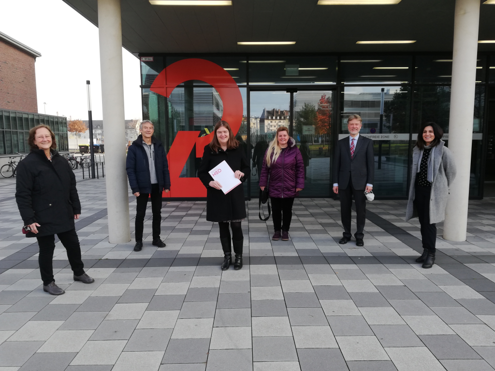

# Archiv

## Unsere Wattenmeerfahrt

### 2019

Wattenmeer 2.0

Nachdem die Fahrt zum Wattenmeer im Jahr 2018 ein voller Erfolg war, sind im Jahr 2019 wieder 21 Schüler\*innen der Jahrgangsstufen 6-9 nach Norddeich gefahren um vor Ort das UNESCO-Weltnaturerbe "Wattenmeer" zu erleben. Auf dem Programm standen eine Wattwanderung, Besuch der Seehundstation mit Besuch der Ausstellung, Beobachten der Seehunde und einem Fachvortrag. Strandbesuch und Sonnenuntergang am Meer rundeten das Exkursionsprogramm ab.

Ein Schülerbericht von Helena Grotegut (2019 in der 6a)

Am 15. Juni 2019 brachen wir morgens um 8 Uhr zur Nordsee auf. Nach einem kurzen Zwischenstopp kamen wir in der Jugendherberge an. Dort bezogen wir die Zimmer und aßen belegte Brötchen. Wir waren insgesamt 21 Schüler und zwei Lehrerinnen, Frau Blöcker und Frau Zaklikowski. Als wir mit dem Essen fertig waren, gingen wir zum Strand und trafen eine Führerin für das Wattenmeer. Sie erzählte viele interessante Dinge zum Watt und zu den Tieren, die dort leben. Später veranstalteten die Lehrer einen Spieleabend. Am nächsten Morgen liefen wir nach dem Frühstück zur Seehundstation. Zuerst hörten wir uns einen kleinen Vortrag dazu an, welche Seehundarten es gibt und wie sie in die Station kommen. Wir sahen uns auch eine Fütterung der Tiere an. Nach der Seehundstation und einer kleinen Pause gingen wir in einen Irrgarten und machten ein Quiz. Am Ende des Tages gingen viele von uns nochmal zum Strand und schauten sich den schönen Sonnenuntergang an. Montag kamen wir mittags wieder an der Schule an. Insgesamt war es ein super Wochenende an der Nordsee!

## 2018

Vom 2. bis zum 4. Juni 2018 fand - anlässlich des 25. Jubiläums unserer Schule als UNESCO-Projektschule - eine stufenübergreifende Fahrt nach Norddeich (an der Nordsee) statt.

Abfahrt war am Samstagmorgen an der Schule. Nach Ankunft in der Jugendherberge erkundeten wir zunächst den Deich und besuchten die lokale Seehund-Station. Wir besichtigten die Ausstellung, hörten uns einen informativen Vortrag über die Region des Wattenmeers als Weltnaturerbe an und duften eine Seehundfütterung beobachten.

Am nächsten Tag machten wir uns rechtzeitig, da wir auf die Gezeiten angewiesen waren, auf den Weg zum nahegelegenen Strand für eine Wattwanderung. Dabei machten wir uns mit der lokalen Tier- und Pflanzenwelt vertraut. Anschließend gingen wir an Bord der Baltrum III für eine Schiffsrundfahrt zu den Seehundbänken. Dabei hatten wir großes Glück mit dem Wetter. Nach unserer Rückkehr hatten wir noch einige Zeit, um uns den Ort Norddeich genauer anzusehen, die lokale Kost zu genießen und Souvenirläden zu besuchen. Am nächsten Morgen machten wir uns wieder auf den Weg nach Hause.

Einer der besonderen Vorzüge dieser Fahrt war, neben der wunderschönen Natur, dass sie stufenübergreifend war. Dadurch hatten die Schüler die Möglichkeit, neue Kontakte zu knüpfen und sich als Schulgemeinschaft näher kennenzulernen. Ein besonderer Dank gilt auch den Lehrern, die sich bereiterklärt hatten, die Fahrt zu beaufsichtigen, womit sie sie erst ermöglichten.

## Schüler/innen-Uni

Im Schuljahr 2018/19 nahm ein Schüler der Stufe 9 an zwei Mathematik-Vorlesungen der Universität Düsseldorf teil. Inzwischen ist der besagte Schüler, nun bereits im Abiturjahrgang, im vierten Jahr Teil des Schüleruni-Programms der HHU.

## Kooperationsvertrag unterzeichnet

Am 2.7.2018 wurde im Büro unserer Schulleiterin, Frau Patten, der Kooperationsvertrag mit der Firma Henkel geschlossen. Für die Firma Henkel unterzeichnete Herr Dr. Müller-Kirschbaum in Anwesenheit der beiden Kontaktpersonen, Frau Dr. Krupp für das Unternehmen und eine Chemielehrerin für unsere Schule, sowie eines Fotografen des Unternehmens, Herrn Beer, und Herrn Woeste. Die Laufzeit des Vertrages beträgt zwei volle Schuljahre und wird sich ungekündigt automatisch um jeweils zwei weitere Schuljahre verlängern.  
Nach der Unterzeichnung überreichte die Schule Herrn Dr. Müller-Kirschbaum - stellvertretend für die Firma Henkel - zu dessen großer Freude eine antike Schautafel zum Thema „Waschmittelinhaltsstoffe“ aus der Chemie-Sammlung der Schule.

„Ich habe ein einwöchiges Praktikum bei Henkel gemacht. Trotz dieser kurzen Zeitspanne hatte ich sehr viele Einblicke und konnte mit viel Wissen mein Praktikum abschließen.“  
*(Nisa Karacan)*

„Ich habe mich im Forschungsteam sehr wohl aufgehoben gefühlt. Schon zu Beginn des Praktikums habe ich theoretische Verfahren gelernt, von denen ich vorher gedacht hätte, sie seien viel zu kompliziert. Es hat mir sehr viel Spaß gemacht, an den Themen rund um die nachhaltige Waschmittelforschung, an den Forschungsarbeiten und der industriellen Produktentwicklung mitwirken zu können. Außerdem hat mich die Vielzahl der Experimente begeistert. Die gewonnene Erfahrung bedeutet mir sehr viel und unterstützt mich für meinen zukünftigen Werdegang.“  
*(Ouassim Amrani)*

## Kooperation mit dem ZIES

Endlich ist es so weit:

Der Kooperationsvertrag mit dem Zentrum für Innovative Energiesysteme (kurz: ZIES) der Hochschule Düsseldorf (HSD) ist unterzeichnet!

Am 25.11.2021 fand dazu ein sehr harmonisches Treffen im Büro der Präsidentin der HSD, Frau Prof.Dr. Vomberg, statt. Corona-konform ausgerüstet nahmen daran für das ZIES Herr Prof.Dr.-Ing. Adam und Frau Ille, seitens unserer Schule Frau Patten, Frau Dr. Danneberg und Herr Dr. Woeste sowie für die Pressestelle der HSD Herr Kirch teil. Zum gemeinsamen Foto in der Sonne vor dem Verwaltungsgebäude der HSD konnten dann auch die Masken fallen.

Damit verfügt nun auch die Physik über einen außerschulischen Partner, der unsere MINT-Säule unterstützt. Beiden Partnern liegt dabei insbesondere die Sensibilisierung der Schülerinnen und Schüler der Schule für einen verantwortungsvollen und nachhaltigen Umgang mit dem Thema „Energie“ und damit die Intensivierung der Verbindung zwischen MINT- und UNESCO-Schwerpunkt der Schule am Herzen.

Im Schülerlabor des ZIES wird unseren Schüler/innen das Thema „Energie“ auf vielfältige Weise und mit aktuellem Bezug zur Klima-Diskussion nähergebracht werden. Das beinhaltet Probevorlesungen, Planspiele oder Tischexperimente ebenso wie die Bereitstellung von Anleitungen und Materialien für die Vor- und Nachbereitung im Unterricht.

Weitere Bausteine der Kooperation werden Experten/innen-Vorträge über Arbeitsschwerpunkte des ZIES und deren wissenschaftliche Grundlagen in Absprache mit den Fachlehrkräften der Schule sein – so zum Beispiel über unsere zukünftige Energieversorgung, Ökobilanzierungen, unseren CO2-Footprint, die energetische Nutzung von Sonnenkraft oder Biomasse - stets in Verbindung mit Hinweisen über Berufsperspektiven in diesen Themenbereichen.

Darüber hinaus werden in speziellen Fällen auf Empfehlung der Fachlehrkräfte auch Schülerpraktika für besonders interessierte Schüler/innen oder Berufsfelderkundungen im Rahmen des Programms „Kein Abschluss ohne Anschluss“ ermöglicht.

G.Woeste, MINT-Sekretariat

Foto: Kirch

## Expertengespräch Chemie

Expertengespräch mit Herrn Dr. Thomas Früh (Gesellschaft Deutscher Chemiker - Vorsitzender der Fachgruppe für Makromolekulare Chemie) im Chemie LK der Jahrgangsstufe Q2 im Schuljahr 2018/19

Der Chemie LK der Jahrgangsstufe Q2 hatte am 24.01.2019 den Vorsitzenden der Fachgruppe Makromolekulare Chemie der Gesellschaft Deutscher Chemiker (GDCh) Herrn Dr. Thomas Früh zu Gast. Herr Dr. Früh informierte in seinem mehrstündigen Besuch zum einen über die Arbeit der GDCh, insbesondere über Angebote für Hochschulabsolventen, zum anderen wollte er mit den Schülerinnen und Schülern aber auch einen fachlichen Austausch führen.  
Neben der spannenden Darstellung seiner eigenen Vita, zeigte Herr Dr. Früh Berufs-Chancen und Perspektiven im Bereich der Chemischen Industrie auf. Sein Fokus lag hier auf der Kunststoff-Chemie. Zum einen da er in der GDCh diesen Fachbereich als Vorsitzender ehrenamtlich leitet, zum anderen da er hauptberuflich im Bereich der Kunststoffe tätig ist. Da das Kursthema des LKs auch gerade die Makromoleküle und Kunststoffe war, konnte hier eine angeregte Diskussion z.B. über Polymere im allgemeinen, Synthesekautschuk, Reaktionsmechanismen, aber auch aktuelle Gefahren, wie z.B. die Mikroplastik-Problematik geführt werden.

## Besuch von Herrn Dr. Sittler am 30.3.2023

Eine Schneeeule hatte **Herr Dr. Sittler** zwar nicht dabei, dafür machte während seines Vortrags zum **Thema "Grönland - Fauna, Flora und Klimawandel" ein Knäuel Moschusochsen-Wolle die Runde**. Einmal mehr konnte der gebürtige Elsässer mit seinen profunden Kenntnissen aus jahrzehntelanger Grönland-Erfahrung und den eindrucksvollen Bildern seiner letzten Expedition die Biologie-Kurse der Oberstufe begeistern. Darüber hinaus gelang es ihm, die unverkennbaren Zeichen des Klimawandels erlebbar zu machen. Dadurch hat er alle weiter in dem Bemühen bestärkt, Klimaschutz im ganz persönlichen Tagesablauf zu praktizieren.

G. Woeste

## Von Lemmingen und Eisbären

### Grönlandfahrer zu Besuch
   
Auf Einladung von Frau Dr. Danneberg hat am 13.12.16 der international bekannte und hoch angesehene Wissenschaftler Dr. Sittler von der Universität Freiburg einen Vortrag in der Aula unseres Gymnasiums gehalten. Dr. Benoit Sittler erkundet seit 1975 Grönland und rief 1988 das Karupelv Valley Project ins Leben mit dem Ziel, Licht in das Dunkel eines geheimnisvollen Verhaltens der Lemminge zu bringen. Lemminge sind Wühlmäuse, die dafür bekannt sind, bei einer hohen Populationsdichte ihren eigenen Bestand durch Massenselbstmord zu dezimieren. Dieses Verhalten ist sprichwörtlich geworden und hat seit je die Menschen fasziniert. Dr. Sittler und seine Mitarbeiter haben mit diesem, zu einem Mythos gewordenen Verhalten aufräumen können. Die extremen Schwankungen in der Population treten in Abständen von vier bis fünf Jahren auf. Dann vermehren sich die Lemminge und dienen so der Fortpflanzung ihrer Fressfeinde. Wird dieses „Vermehrungshoch“ durch ein „Vermehrungstief“ abgelöst, dünnen sich die Bestände der Fressfeinde bedrohlich aus.  
Dr. Sittler hat die Bestandsabhängigkeit zwischen Beute (Lemminge) und Räuber (Hermelin, Fuchs, Schnee-Eule und Eisbär) sehr anschaulich und unterhaltsam dargestellt. Besonderes Interesse erregten seine Ausführungen über den Klimawandel. Da seit Jahren das Packeis schmilzt, verlieren die Eisbären ihre Lebensgrundlage und müssen daher Schritt für Schritt das Festland erobern. Dies hat zur Folge, dass Dr. Sittler und seine Expeditionsmannschaft regelmäßig Besuch von Eisbären bekommen. Einmal hat ein Eisbär sogar Hausfriedensbruch begangen: Ihm ist es in Abwesenheit der Expeditionsmitglieder gelungen, das vernagelte Fenster zu öffnen (die Nägel hat er einzeln herausgezogen), einzudringen und sich in der guten Stube mal umzugucken. Dies alles ist von einer Kamera gefilmt worden. Auch die Schilderung manch anderer abenteuerlicher Begebenheiten sorgte für einen kurzweiligen und informativen Nachmittag.

## Die Klasse 6a in Kiel

Die 6a - Klassenfahrt nach Kiel 10. bis 14. September 2018

Am Montag kamen wir nachmittags in der Jugendherberge in Kiel an und unser Abenteuer begann.

Dienstag Morgen schipperten wir schon früh mit dem Boot über die schöne Kieler Förde bis nach Laboe. Dort gingen wir in ein Kriegsboot und besuchten anschließend die Meeresbiologische Station. Wir konnten einen Seestern anfassen und kleine Haie sehen.

Am Mittwoch im Zoologischen Museum bekamen wir Aufgaben, die wir in einer bestimmten Zeit erfüllen mussten. Wir sahen ein riesiges Walskelett.

Mit viel besserem Wetter ging es Donnerstag den ganzen Tag ins Freilichtmuseum Molfsee bei Kiel. Wir stellten selbst Flachs her, schauten uns ganz alte Bauernhäuser aus Schleswig-Holstein an und waren lang auf einem Kettenkarussell und bei den Ziegen.

Abends machten wir Spieleabende oder waren draußen zum Spielen.

(Liva und Helena, zu der Zeit Klasse 6a)

## 