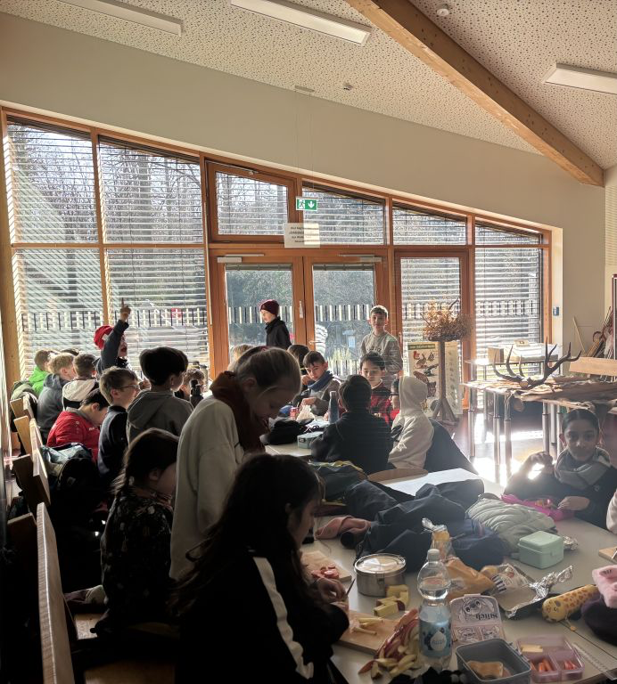

## Wildparkexkursion der Klasse 5a

Am Dienstag, den 18.02.2025, waren wir mit unserer Klassenlehrerin Frau Engelberty und Herrn Woeste im Grafenberger Wildpark.

Nach der Ankunft sind wir erstmal durch den Wildpark geschlendert. Bevor wir zur Waldschule gegangen sind, haben wir die Wildschweine mit Möhren und Äpfeln gefüttert, die wir von zuhause mitgebracht hatten. Besonders interessant für die Klasse waren die Frischlinge.

Im Klassenzimmer der Waldschule haben wir zunächst gefrühstückt. Anschließend hat uns dort ein Parkführer spannende Dinge über die verschiedenen Hirscharten erzählt, zum Bespiel wie das Geweih aufgebaut ist oder wie lange es schon Rehe gibt. Zum Abschluss durften wir das Fell und das Geweih von einem Reh, einem Rothirsch und einem Damwild anfassen.

Danach sind wir am Damwildgehege vorbeigegangen und durften die Tiere dort auch füttern und streicheln. Dann wollten wir die Eichhörnchen sehen, aber diese waren gerade leider nicht da. Die Frettchen haben leider geschlafen, aber der Fuchs war wach. Nachdem wir beim Fuchs waren, durften alle sich für zwanzig Minuten frei bewegen. Manche Kinder haben weiter das Damwild gefüttert, einige Kinder haben den Fuchs weiter beobachtet und andere Kinder haben auf dem Spielplatz geschaukelt oder sich unterhalten.

Gegen 13:30 Uhr sind wir wieder mit der U-Bahn bei der Schule angekommen.

Es war ein schöner, interessanter und langer Ausflug.

(von Simon Q. Schüler aus der 5a)

## Ausflug zum Grafenberger Wildpark

Im Biologieunterricht beschäftigen wir, die 5b, uns mit den Angepasstheiten der Säugetiere an extreme Lebensräume und an die verschiedenen Jahreszeiten. Die Frage: „Wie überwintern denn unsere heimischen Säugetiere?“ wollten wir vor Ort untersuchen und machten uns kurz vor den Weihnachtsferien zusammen mit Frau Hübethal und Frau Auell auf den Weg zum Grafenberger Wald, um dort Rot-, Damwild und Rehe zu beobachten und zu erfahren, wie sie den Winter bei uns verbringen.

Frau Walker, die Waldpädagogin der Waldschule, empfing uns am Morgen, führte uns durch den Grafenberger Wald, um Schlafstätten der Rehe zu suchen, erzählte uns Spannendes zu den Überwinterungsstrategien der Tiere, demonstrierte uns in Form eines lustigen Spiels, wie Wölfe z.B. Rotwild jagen und zeigte uns in der Waldschule die verschiedenen Sommer- und Winterfelle von Dam, Rotwild und Rehen. Ein absolutes Highlight war dann natürlich die Fütterung der Tiere. Hier konnten sämtliche zu Hause liebevoll geschnittene Apfel-, und Möhrenstücke an die Rehe verfüttert werden, die sich zahlreich einstellten. Schweren Herzens mussten wir dann Abschied nehmen und die Heimreise antreten. Ein toller Ausflug, so kurz vor den Ferien!

(Ute Hübethal)

## Das ist kein Reh!

(Besuch im Wildpark am 28.4.2025)

Ja, das wissen alle Schüler/innen der Klasse 5c nun. Das ist nämlich Damwild.

Aber der Reihe nach. Im Biologie-Unterricht wird in den fünften Klassen über Säugetiere gesprochen und darüber, wie sie sich an ihre Umgebung anpassen. Damit das alles etwas anschaulicher wird, kam die Idee auf, einen passenden Lernort dafür zu suchen. Schnell kamen wir darauf, die Waldschule im Wildpark Düsseldorf zu besuchen. Dort können Tiere nämlich auch richtig hautnah erlebt werden.

So ging es zuerst einmal per Straßenbahn in den Stadtteil Gerresheim und von dort aus zu Fuß zum Grafenberger Wald. Am Eingang trafen wir eine Waldpädagogin, die uns begrüßte und sich dann mit uns auf unseren Rundweg durch den Wildpark machte. Also, wer schon einmal im Wildpark gewesen ist, der weiß, dass man mit der Sichtbarkeit der Tiere ziemlich Pech haben kann. Aber wir haben einen richtig guten Tag erwischt. Schon am ersten Gehege freuten sich die Tiere am Zaun auf ein Frühstück. Während die ersten Apfel- und Karottenstückchen verteilt wurden, erfuhren wir, dass wir hier gerade Rotwild vor uns haben, warum es so heißt und dass der Hirsch ein Geweih hat, das sich jedes Jahr unter einer Haut, die Bast heißt, neu bildet, wenn das alte abgeworfen wurde. Die Weibchen erwarten übrigens Junge. Sie waren daher ganz schön dick.

Die Wildschweine waren leider nicht zu sehen. Im Gehege wurde repariert und aufgeräumt. Daher hatten sich die Wildschweine in den dichten Wald zurückgezogen. Nach unserer Frühstückspause lernten wir bei einem Spiel, wie Wölfe einen Hirsch fangen. Dazu waren einige wenige von uns Hirsche, alle anderen waren Wölfe. Dann ging es los. Es brauchte etwas, bis wir verstanden haben, dass alle Wölfe zusammenarbeiten und sich auf einen einzigen Hirsch konzentrieren müssen, damit das schnell geht.

Nun ging es weiter in einen Raum, in dem mehrere Felle und Geweihe lagen. Wir lernten den Unterschied zwischen Sommer- und Winterfell kennen und welches Fell und welches Geweih zum Rotwild, Rehwild oder Damwild gehört. Die Felle waren alle sehr weich und die Geweihe vom Rotwild und vom Damwild waren sehr schwer.

Jetzt gingen wir durch das Damwildgehege. Einer der Hirsche hatte sein linkes Auge verloren. Er tat uns sehr leid. Die Weibchen erhoben sich von der Wiese, als sie uns sahen, und kamen zu uns auf den Weg. So konnten wir sie füttern und streicheln. Das war richtig cool! Auch hier hat die Waldpädagogin wieder einiges erklärt. Zum Beispiel warum etwas gefüttert werden darf und warum nicht und wie die Mutter ihr Junges im Wald findet. Hier sagt nun keiner mehr: das ist ein Reh. Und was man zum Füttern mitbringen sollte und was nicht, ist nun auch allen klar.

Nachdem wir uns bedankt und verabschiedet haben, ging es noch kurz zu den Eichhörnchen, der Wildkatze, dem Fuchs und dem Bienenhaus. Danach machten wir uns auf den Rückweg. Insgesamt war der Schultag sehr schön.

(Woeste)

## Erlebnisbericht: Ausflug der Klasse 6b in die Forscherwelt Henkel

(6.2.2025)

Die Klasse 6b unternahm einen Ausflug in die Forscherwelt Henkel. Am Morgen trafen sich die Schülerinnen und Schüler auf dem Schulhof und fuhren gemeinsam mit ihren Lehrerinnen Frau Röhl und Frau Poeck mit der Bahn zum Gelände von Henkel.

Nach der Ankunft erhielten alle Schülerinnen und Schüler Laborkittel und Schutzbrillen. Anschließend wurden sie in Gruppen aufgeteilt und bekamen eine Einführung in die Sicherheitsregeln des Labors sowie eine kurze Erklärung zum Umgang mit verschiedenen Geräten wie Waagen, Rührgeräten und diversen Glasgeräten.

Im weiteren Verlauf des Tages beschäftigten sich die Kinder mit verschiedenen Experimenten. Der Schwerpunkt lag auf der Herstellung von Klebstoffen. Unter Anleitung mischten die Gruppen verschiedene Substanzen und untersuchten die Eigenschaften der entstandenen Produkte und verglichen sie miteinander. Dabei lernten sie, dass kleine Veränderungen in der Zusammensetzung die Klebekraft deutlich beeinflussen können.

Ein weiterer Aspekt des Tages war die Förderung der Zusammenarbeit innerhalb der Gruppen. Die Schülerinnen und Schüler mussten Aufgaben gemeinsam lösen, Versuche planen und ihre Ergebnisse dokumentieren.

Zum Abschluss des Besuchs gab es eine Feedbackrunde.

Der Ausflug bot der Klasse 6b die Gelegenheit, praktische Erfahrungen im Labor zu sammeln und Grundkenntnisse im Experimentieren sowie im Bereich der Teamarbeit zu erwerben.

(Poeck)

## Ein neuer außerschulischer Lernort

Heute, am 8.1.2025, waren wir bei einem Lernort, der Coding For Tomorrow heißt. Das ist jetzt ein neuer Teil unseres Informatik-Unterrichts in der Stufe 6. Am Anfang haben wir viel zu Plastikmüll in den Weltmeeren erfahren. Einiges davon kannten wir schon aus dem Besuch von Frau Lutz im letzten Schuljahr.

Wir bekamen dann die Aufgabe, mit dem Programm Scratch ein Spiel zu bauen, bei dem ein Taucher Müll aus dem Meer sammelt. Für jedes Teil sollte es einen Punkt geben. Wir setzten uns an die Tablets. Die einzelnen Befehle für das Programm wurden uns zwischendurch immer erklärt. Erst ging alles schief. Der Taucher schwamm rückwärts oder die Müllteile fielen zu schnell ins Wasser. Aber am Ende hat der Taucher alles erwischt und auch die Punkte richtig bekommen. So haben wir richtig jeder ein Spiel gebaut. Wir durften es dann nicht mitnehmen, aber wir haben zum Abschied eine Internetadresse bekommen, mit der wir Scratch finden können.

(Woeste)

## Wir alle können etwas tun

Am Anfang spricht Mutter Erde. Sie beschreibt und zeigt die vielen schönen Landschaften, die sie in vielen Millionen Jahren hervorgebracht hat. Auf dem Weg dahin hat sie sich oft an neue Bedingungen anpassen müssen. Das ist ihr jeweils gelungen. Da sie das alles ohne uns Menschen vollbracht hat, weiß sie, dass sie uns Menschen auch in Zukunft nicht benötigt. Sie kommt alleine klar, sie ist auf alles vorbereitet. Und so endet sie mit einer Frage an die Klasse: seid auch ihr vorbereitet?

Was für eine gewaltige Frage an so junge Menschen, denke ich. Aber meine Sorge wird schnell zerstreut. Den Schüler/innen ist durchaus bewusst, dass die Lage ernst ist. Sehr klar können sie die Probleme benennen: die ständig zunehmenden Extremwetter mit ihren Folgen wie Überschwemmungen, Dürren, Abschmelzen von Gletschern und Polen, Aussterben von Tier- und Pflanzenarten. Auch die Ursachen sind schnell benannt: Abgase, Müll, Treibhauseffekt, Verschmutzung der Meere. Ein bisschen schwerer tun sich viele damit, wenn sie beschreiben sollen, was man dagegen tun kann. Dabei helfen die in Gruppen zusammen bearbeiteten Themenblätter zu Ernährung, Konsum, Mobilität und Zuhause. Beeindruckt bin ich dann davon, wie gut es fast alle verstehen, den jeweils anderen Gruppen die erarbeiteten Antworten vorzustellen und näher zu bringen. So ist am Ende wohl allen klar: Ich selbst kann etwas tun und weiß auch wie. Nun muss es nur noch jede und jeder täglich für sich machen!

Vielen Dank an die Nachhaltigkeitsbotschafter unseres Kooperationspartners Henkel für ihre Besuche in den 7. Klassen am 6.5./6.5./12.5./22.5.2025: Frau Antonios, Frau Fahrland, Frau Hartmann, Frau Hojenski, und Frau Jeske

(Woeste)

## Besuch beim DLR in Köln

Am 14.02.2025 ist unser EF-Physik-Kurs in das Deutsche Luft- und Raumfahrtzentrum (DLR) in Köln gefahren. Dort erwartete uns ein vielseitiger Tag mit vielen Experimenten, einem Vortrag und einem Besuch im Kontrollzentrum der ISS.

Der Tag begann mit einem Vortrag und einer kleinen Diskussion zum Thema „Sind wir allein?“. Dabei wurde zuerst darüber gesprochen, was Leben eigentlich ist und wie es auf der Erde aus immer komplexeren biologischen Molekülen entstanden sein könnte. Ein weiteres Thema des Vortrags waren die Bedingungen für Leben auf anderen Planeten. Als Kandidaten für Leben im Sonnensystem ging es am Ende noch um den Saturnmond Enceladus, der unter einer Eis-schicht eine lebensfreundliche Unterwasserwelt verbirgt, und um eine geplante Forschungs-mission, die in den nächsten Jahrzehnten in diese Unterwasserwelt vordringen soll. Anschließend führten wir in Kleingruppen einige interessante Experimente durch:

• **Galvanik**: Mithilfe der Galvanik kann man die verschiedensten Werkstoffe miteinander kombinieren, um sich die Eigenschaften zu Nutze zu machen. Während des Experiments haben wir die Zugfestigkeit und die Wärmeleitfähigkeit von Wolfram und Kupfer mithilfe eines Programms gemessen. Zum Schluss stellten wir fest, dass Kupfer eine bessere Wärmeleit-fähigkeit hat als Wolfram. Dafür aber hat Wolfram eine höhere Zugfestigkeit als Kupfer.

• **Lärmkontrolle**: Was ist Lärm eigentlich? Den meisten kommen sofort nervige Geräusche wie überfüllte Autobahnen, beschäftige Geschäfte und Taylor Swift in den Sinn. Nur wie dämmt man diese nervenden Geräusche? Das geht bspw. mit „Noise Cancellation“, die man aus Kopfhörern kennt. Dieses und viele weitere Konzepte (groß angewandt) wurden uns innerhalb des Experimentes „Lärmkontrolle“ näher gebracht - sowohl theoretisch als auch praktisch.

• **Suche nach Leben**: Im Experiment „Suche nach Leben“ haben wir kleine Kapseln gekriegt. Die Kapseln beinhalteten verschiedene Stoffe wie Glucose, Eiweiß, Aminosäuren und Stärke. Wir sollten nachweisen, dass diese Stoffe in den Kapseln enthalten waren. Es gab 26 verschiedene Kapseln von A-Z und jede Kapsel hatte eine oder mehrere der vier oben genannten Stoffe. Wir haben andere Stoffe mit unserer Probe vermischt und teilweise erhitzt. Danach haben wir beobachtet, wie die Stoffe miteinander reagiert haben. Am Ende haben wir verschiedene Ergebnisse gekriegt, da die meisten verschiedene Kapseln hatten, welche verschiedene Stoffe beinhalteten. Es war sehr interessant und hat Spaß gemacht, weil man aktiv experimentiert hat.

• **Schwerelosigkeit**: Ziel dieses Experiments war es, zu beobachten, wie sich Objekte ohne die Wirkung der Schwerkraft verhalten. Wir ließen einen Gegenstand in einer speziellen Fallvorrichtung fallen und filmten es mit einer Kamera, die in der Kammer war und den Gegenstand beobachtete. Während des Falls befand sich das Objekt kurz in einem Zustand der Schwerelosigkeit. Außerdem beobachteten wir Wassertropfen, die sich in Schwerelosigkeit zu Kugeln formten. Das Experiment zeigte, dass Schwerelosigkeit entsteht, wenn sich ein Objekt im freien Fall befindet. Flüssigkeiten verhalten sich anders als auf der Erde, da Oberflächenspannung die dominierende Kraft ist.

• **Docking-Training**: Wie schwierig ist es eigentlich, eine Raumkapsel an eine Raumstation anzudocken? Das konnten wir in diesem Experiment ausprobieren. Zwei Schüler sitzen an einem Docking-Simulator, einer fährt und einer schaut zu und hilft als Beifahrer. Das Ziel ist es, das 'Fahrzeug' sicher an die vorgegebene Andockstelle anzudocken. Was ein solches Training schwer macht ist, dass man Raumfahrzeuge in alle Richtungen bewegen kann, was das Risiko zu scheitern erhöht. Es war interessant, einmal in die Rolle eines Astronauten zu schlüpfen.

• **Muskelphysiologie**: Hier beschäftigte sich eine Gruppe mit dem Sauerstoffgehalt in unseren Muskeln. Nachdem wir uns die biologischen Hintergründe angeschaut haben, durften wir selbst aktiv werden. Mit einem professionellen Messgerät konnten Schüler statische und dynamische Muskelübungen ausführen, während die anderen Mitschüler live Werte wie die Sauerstoffsättigung des Bluts betrachten und auswerten konnten.

Nach dem Mittagessen haben wir gemeinsam das Kontrollzentrum MUSC (Microgravity User Support Centre) besucht, um uns einen Einblick in die Arbeit echter Astronaut\*innen zu verschaffen, und konnten dabei auch eine live Übertragung von der ISS zu sehen bekommen. Dort wurden uns außerdem zwei vergangene Weltraummissionen vorgestellt und wir konnten Modelle der verwendeten Sonden und Rover betrachten.

Insgesamt war es ein sehr interessanter und interaktiver Tag, bei dem viele Fragen beantwortet und noch mehr Fragen aufgeworfen wurden.

